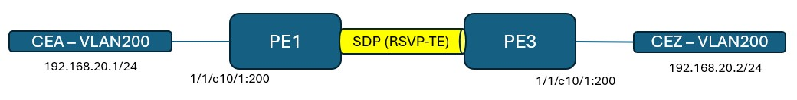
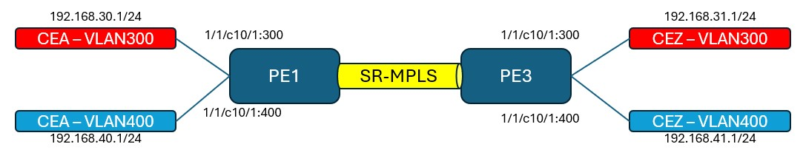
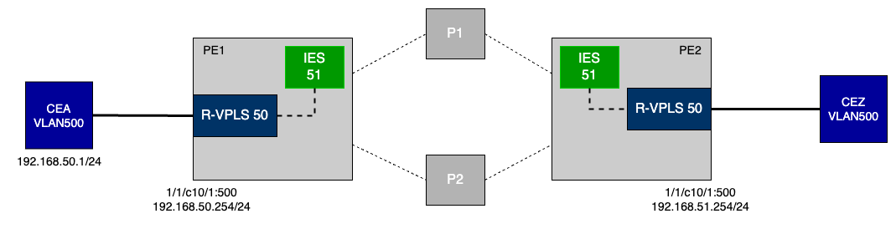
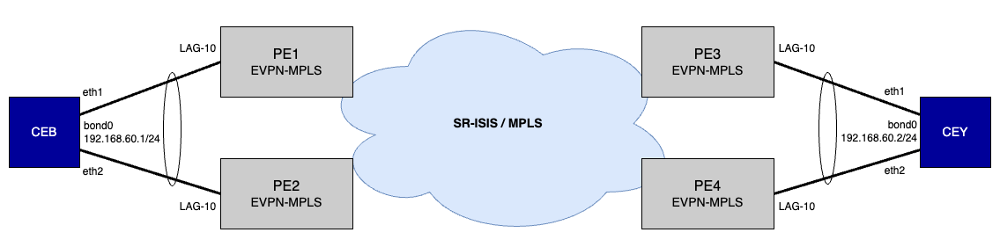

# Nokia SR OS Service Configuration

This page provides the basic step-by-step configuration required to set up services on a Nokia 7750 Service Router. All the required feature sets for each service type are covered here with configuration and show examples. Most sections also provide links to Nokia documentation for further reading.

| Contributors | Handle |
|---|---|
| Mohammad Zaman | [mfzhsn](https://github.com/mfzhsn) |
| Saju Salahudeen | [sajusal](https://github.com/sajusal) |

All configurations are in MD-CLI flat format. Reference chassis is 7750 SR-1-24D and software version is SR OS 25.3.R1. Use `show system info` command to verify your router's chassis model and software version.

The following services are covered in this guide:

- [Epipe](#Epipe)
- [VPLS](#VPLS)
- [VPRN](#VPRN)
- [IES](#IES)
- [EVPN-VPWS](#EVPN-VPWS)
- [EVPN-MPLS](#EVPN-MPLS)

A summary of what this guide provides is shown below.


Disclaimer: This is not an exhaustive list of all the features and associated options on SR OS for services. This does not replace official documentation but is a one stop reference guide for basic service configuration. For more details on the features and options, please refer to the documentation links in each section.

# Topology

We will be using the below topology with 4 Provider Edge (PE) routers, 2 Provider (P) routers and 4 Customer Edge (CE) routers.

All configuration examples are shown for PE routers. Refer to the startup config files for configuration on other routers.


IPv4 Addressing:


# MD-CLI Command Reference

Here's a reference table with some commonly used commands.

| Action | Command |
| --- | --- |
| Enter candidate mode | `configure private` |
| Commit configuration changes | `commit` |
| Delete configuration elements | `delete {command path}` |
| Discard configuration changes | `discard` |
| Compare candidate to running | `compare /` |
| View configuration in current context | `info` |
| View configuration in flat format | `info full-context` |
| View full configuration of router | `admin show config` |
| Search for keyword in output | `<command> \| match {keyword}` |
| Find a command | `tree flat detail \| match <keyword>` |
| Exit candidate mode | `exit` |
| Exit from router | `logout` |

# Hardware Configuration

Assuming this is a brand new router, the cards should be configured before we proceed with the peering configuration. If this is already done, you can skip this section.

The card and mda types depend on the variant of the 7750 SR in use. The equipped card and mda types can be seen using the `show card state` command.

Our topology is using a fixed form factor chassis (SR-1-24D) and no hardware configuration is required on this chassis.

For modular systems, the following configuration should be completed to bring up the line card modules. The example config below is for a 7750 SR-2se. Choose the correct card type and level for your chassis.

Configure power modules:

```
/configure chassis router chassis-number 1 power-shelf 1 power-shelf-type ps-a4-shelf-dc
/configure chassis router chassis-number 1 power-shelf 1 power-module 1 power-module-type ps-a-dc-6000
/configure chassis router chassis-number 1 power-shelf 1 power-module 2 power-module-type ps-a-dc-6000
/configure chassis router chassis-number 1 power-shelf 1 power-module 3 power-module-type ps-a-dc-6000
/configure chassis router chassis-number 1 power-shelf 1 power-module 4 power-module-type ps-a-dc-6000
```

Configure fabric cards:

```
/configure sfm 1 sfm-type sfm-2se
/configure sfm 2 sfm-type sfm-2se
/configure sfm 3 sfm-type sfm-2se
/configure sfm 4 sfm-type sfm-2se
```

Configure line card:

```
/configure card 1 card-type xcm-2se
/configure card 1 mda 1 mda-type x2-s36-800g-qsfpdd-12.0t

# On systems with XIOM:
/configure card 1 card-type xcm-2se
/configure card 1 xiom "x1" xiom-type x2-s36-800g-qsfpdd-6.0t
/configure card 1 xiom "x1" mda 1 mda-type m36-800g-qsfpdd
```

Refer to the `show commands` section in this guide for relevant hardware show commands.

# Ports and Interfaces

Physical port is configured first following by an interface with an IPv4 or IPv6 address.

Each port is considered as a ‘connector’ and supports breakout. The breakout type used on the connector should be configured first which then unlocks the individual ports in the breakout for configuration.

All ports have an associated port mode. Network facing ports used in the base routing instance should be in 'network' mode (default). Client facing ports used in a service should be in 'access' mode. If a port is both network and client facing, it can be set to 'hybrid' mode. Minimum encap on a hybrid port is dot1q.

In this example, we are configuring the connector to use a 1x100G breakout.

```
/configure port 1/1/c1 admin-state enable
/configure port 1/1/c1 connector breakout c1-100g
/configure port 1/1/c1/1 admin-state enable
/configure port 1/1/c1/1 description "To P1"
```

Below is an example of a client facing port configured as 'access' mode with dot1 encap.

```
/configure port 1/1/c10 admin-state enable
/configure port 1/1/c10 connector breakout c4-10g
/configure port 1/1/c10/1 admin-state enable
/configure port 1/1/c10/1 ethernet mode access
/configure port 1/1/c10/1 ethernet encap-type dot1q
/configure port 1/1/c10/1 ethernet mtu 5000
```    

Refer to the `show commands` section in this guide for relevant port show commands.

The interface is given a name, IP and associated to a physical port.

```
/configure router "Base" interface "To-P1" port 1/1/c1/1
/configure router "Base" interface "To-P1" ipv4 primary address 172.16.10.0 prefix-length 31
```

The `system` interface is the router's loopback interface (like lo0 or loopback0). The name of this interface cannot be changed. If no explicit `router-id` is configured, the `system` interface IPv4 address is used as the router-id. The `system` interface should be assigned a /32 IP.

```
/configure router "Base" interface "system" ipv4 primary address 10.10.10.1 prefix-length 32
```

Refer to the `show commands` section in this guide for relevant interface show commands.

BFD can be enabled under the interface for both IPv4 and IPv6. In SR OS, BFD is enabled once under the interface along with the timers and the state is shared with different protocols running over that interface by enabling `bfd-liveness` under each protocol's context.

```
/configure router "Base" interface "To-P1" ipv4 bfd admin-state enable
```

Enabling BFD state sharing on OSPF:

```
/configure router ospf area 0 interface "To-P1" bfd-liveness remain-down-on-failure true
```

Refer to the `show commands` section in this guide for relevant bfd show commands.

# Underlay Routing

## IGP - OSPF

In this example, we are configuring a OSPFv2 neighbor. Port and interface configuration is similar to what is shown in previous section. OSPF is given a higher preference value so that ISIS is preferred in our topology.

For more details on OSPF configuration, visit [SR OS OSPF Documentation](https://documentation.nokia.com/sr/25-3/7x50-shared/unicast-routing-protocols/ospf.html).

```
/configure router "Base" ospf 0 admin-state enable
/configure router "Base" ospf 0 preference 20
/configure router "Base" ospf 0 area 0.0.0.0 interface "To-P1" interface-type point-to-point
/configure router "Base" ospf 0 area 0.0.0.0 interface "system" interface-type point-to-point
```

Refer to the `show commands` section in this guide for relevant OSPF show commands.

## IGP - IS-IS

In this example, we are configuring the router to be in IS-IS Level 1 and 2 (default). Port and interface configuration is similar to what is shown in previous section.

For more details on IS-IS configuration, visit [SR OS IS-IS Documentation](https://documentation.nokia.com/sr/25-3/7x50-shared/unicast-routing-protocols/is-is.html).

```
/configure router "Base" isis 0 admin-state enable
/configure router "Base" isis 0 area-address [49.0000]
/configure router "Base" isis 0 interface "To-P1" interface-type point-to-point
/configure router "Base" isis 0 interface "system" interface-type point-to-point
```

Refer to the `show commands` section in this guide for relevant IS-IS show commands.

## BGP

We will be using BGP to advertise VPN-IPv4 address family for VPRN service and EVPN address family for EVPN-MPLS service.

Only PE1 and PE3 will participate in VPRN service.

All 4 PEs will participate in EVPN-MPLS service.

For more details on BGP configuration, visit [SR OS BGP Documentation](https://documentation.nokia.com/sr/25-3/7x50-shared/unicast-routing-protocols/bgp.html).

```
/configure router "Base" bgp router-id 10.10.10.1
/configure router "Base" bgp group "pe" peer-as 64500
/configure router "Base" bgp neighbor "10.10.10.2" group "pe"
/configure router "Base" bgp neighbor "10.10.10.2" family evpn true
/configure router "Base" bgp neighbor "10.10.10.3" group "pe"
/configure router "Base" bgp neighbor "10.10.10.3" family vpn-ipv4 true
/configure router "Base" bgp neighbor "10.10.10.3" family evpn true
/configure router "Base" bgp neighbor "10.10.10.4" group "pe"
/configure router "Base" bgp neighbor "10.10.10.4" family evpn true
```

Refer to the `show commands` section in this guide for relevant BGP show commands.

# Transport Protocol

## LDP

We will enable LDP to be used as a transport tunnel for services.

For more details on LDP configuration, visit [SR OS LDP Documentation](https://documentation.nokia.com/sr/25-3/7x50-shared/mpls/label-distribution-protocol-mpls.html).

```
/configure router "Base" ldp interface-parameters interface "To-P1" ipv4 admin-state enable
/configure router "Base" ldp interface-parameters interface "To-P2" ipv4 admin-state enable
```

Refer to the `show commands` section in this guide for relevant LDP show commands.

## RSVP-TE

We will enable RSVP-TE to be used as a transport tunnel for services.

For more details on RSVP configuration, visit [SR OS RSVP Documentation](https://documentation.nokia.com/sr/25-3/7x50-shared/mpls/mpls-rsvp.html).

Configure RSVP-TE:

```
/configure router "Base" rsvp admin-state enable
/configure router "Base" rsvp interface "To-P1" { }
/configure router "Base" rsvp interface "To-P2" { }
/configure router "Base" rsvp interface "system" { }
```

Configure MPLS:

```
/configure router "Base" mpls admin-state enable
/configure router "Base" mpls interface "To-P1" { }
/configure router "Base" mpls interface "To-P2" { }
/configure router "Base" mpls interface "system" { }
```

Configure MPLS LSP:

```
/configure router "Base" mpls path "loose" admin-state enable
/configure router "Base" mpls path "loose" hop 1 ip-address 10.10.10.10
/configure router "Base" mpls path "loose" hop 1 type strict
/configure router "Base" mpls lsp "lsp-to-R3" admin-state enable
/configure router "Base" mpls lsp "lsp-to-R3" type p2p-rsvp
/configure router "Base" mpls lsp "lsp-to-R3" to 10.10.10.3
/configure router "Base" mpls lsp "lsp-to-R3" path-computation-method local-cspf
/configure router "Base" mpls lsp "lsp-to-R3" { primary "loose" }
```

Refer to the `show commands` section in this guide for relevant MPLS/RSVP show commands.

## Segment Routing

In this example, we will configure SR-MPLS over ISIS (SR-ISIS). SR OS also supports SR-OSPF.

For more details on SR-MPLS configuration, visit [SR OS SR Documentation](https://documentation.nokia.com/sr/25-3/7x50-shared/segment-routing-pce-user/segment-rout-with-mpls-data-plane-sr-mpls.html).

Configure MPLS label range for Segment Routing:

```
/configure router "Base" mpls-labels sr-labels start 21000
/configure router "Base" mpls-labels sr-labels end 22000
```

Configure Segment Routing for ISIS:

```
/configure router "Base" isis 0 advertise-router-capability as
/configure router "Base" isis 0 traffic-engineering true
/configure router "Base" isis 0 segment-routing admin-state enable
/configure router "Base" isis 0 segment-routing prefix-sid-range global
/configure router "Base" isis 0 interface "system" ipv4-node-sid index 1
```

Refer to the `show commands` section in this guide for relevant SR-MPLS show commands.

## SR-TE

Segment Routing - Traffic Engineering (SR-TE) can be used to build LSPs similar to RSVP-TE.

For more details on SR-TE configuration, visit [SR OS SR-TE Documentation](https://documentation.nokia.com/sr/25-3/7x50-shared/segment-routing-pce-user/segment-rout-with-mpls-data-plane-sr-mpls.html#ai9ekdb660).

In this example, we will configure a SR-TE LSP using loose hops in which case the IGP path will be selected.

```
/configure router "Base" mpls path "loose" admin-state enable
/configure router "Base" mpls lsp "lsp-sr-te-R3" admin-state enable
/configure router "Base" mpls lsp "lsp-sr-te-R3" type p2p-sr-te
/configure router "Base" mpls lsp "lsp-sr-te-R3" to 10.10.10.3
/configure router "Base" mpls lsp "lsp-sr-te-R3" path-computation-method local-cspf
/configure router "Base" mpls lsp "lsp-sr-te-R3" primary "loose" { }
```

Refer to the `show commands` section in this guide for relevant SR-TE show commands.

# ACL

ACL filter policies, also referred to as Access Control Lists (ACLs) or just ‟filters”, are sets of ordered rule entries specifying packet match criteria and actions to be performed to a packet upon a match. Filter policies are created with a unique filter ID and filter name. After the filter policy is created, the policy must then be associated with services.

For more details on ACL, visit [SR OS ACL Documentation](https://documentation.nokia.com/sr/25-3/7x50-shared/router-configuration/filter-policies-router-configuration.html).

Refer to the section for each service type for examples on applying ACL to that service type.

Below is an example of a IPv4 ACL.

```
/configure filter ip-filter "Epipe-ACL" filter-id 101
/configure filter ip-filter "Epipe-ACL" entry 10 match protocol icmp
/configure filter ip-filter "Epipe-ACL" entry 10 match dst-ip address 192.168.10.2
/configure filter ip-filter "Epipe-ACL" entry 10 match dst-ip mask 255.255.255.255
/configure filter ip-filter "Epipe-ACL" entry 10 action accept
```

The ACL is applied to the service SAP.

```
/configure service epipe "Epipe-VLAN100" sap 1/1/c10/1:100 ingress filter ip "Epipe-ACL"
```

Refer to the `show commands` section in this guide for relevant ACL show commands.

# QoS

SR OS implements QoS with a 4-step process – Classification, Queueing, Scheduling and (Re)Marking.

QoS policies can be applied under the following contexts:

- SAP Ingress (for traffic ingressing a service)
- SAP Egress (for traffic egressing a service)
- Network Ingress (for traffic ingressing a Network facing port or uplink)
- Network Egress (for traffic egressing a Network facing port or uplink)

For more details on QoS implementation, visit [SR OS QoS Documentation](https://documentation.nokia.com/aces/sr/25-3/7750-sr/titles/qos.html).

## QoS - Classification

At Service Ingress, Classification is configured in a `sap-ingress` policy.

```
/configure qos sap-ingress "CE-ingress-QoS" dscp cs1 fc "af"
```

The `sap-ingress` policy is applied to the service SAP.

```
/configure service epipe "Epipe-VLAN100" sap 1/1/c10/1:100 ingress qos sap-ingress policy-name "CE-ingress-QoS"
```

At Network Ingress, Classification is configured in a `network` policy.

```
/configure qos network "Network-QoS" policy-id 10
/configure qos network "Network-QoS" ingress dscp cs1 fc af
/configure qos network "Network-QoS" ingress dscp cs1 profile in
/configure qos network "Network-QoS" ingress lsp-exp 6 fc h1
/configure qos network "Network-QoS" ingress lsp-exp 6 profile in
```

The Network classification policy is applied to the network facing interface.

```
/configure router "Base" interface "To-P1" qos network-policy "Network-QoS"
```

Refer to the section for each service type for examples on applying QoS classification to that service type.

## QoS - Queuing

At Service Ingress, Queuing is configured in a `sap-ingress` policy.

```
/configure qos sap-ingress "CE-ingress-QoS" policy-id 11
/configure qos sap-ingress "CE-ingress-QoS" queue 2 rate pir 100
/configure qos sap-ingress "CE-ingress-QoS" queue 2 rate cir 100
/configure qos sap-ingress "CE-ingress-QoS" fc "af" queue 2
/configure qos sap-ingress "CE-ingress-QoS" fc "af" profile in
```

At Service Egress, Queuing is configured in a `sap-egress` policy.

```
/configure qos sap-egress "CE-egress-QoS" policy-id 12
/configure qos sap-egress "CE-egress-QoS" queue 3 rate pir 100
/configure qos sap-egress "CE-egress-QoS" queue 3 rate cir 100
/configure qos sap-egress "CE-egress-QoS" fc be queue 3
```

Both `sap-ingress` and `sap-egress` policies are applied under the service SAP.

```
/configure service epipe "Epipe-VLAN100" sap 1/1/c10/1:100 ingress qos sap-ingress policy-name "CE-ingress-QoS"
/configure service epipe "Epipe-VLAN100" sap 1/1/c10/1:100 egress qos sap-egress policy-name "CE-egress-QoS"
```

At Network Ingress and Egress, Queuing is configured in a `network-queue` policy.

```
/configure qos network-queue "Network-queue" fc af queue 3
/configure qos network-queue "Network-queue" fc ef queue 2
/configure qos network-queue "Network-queue" queue 2 rate pir 15
/configure qos network-queue "Network-queue" queue 2 rate cir 10
/configure qos network-queue "Network-queue" queue 3 rate pir 10
/configure qos network-queue "Network-queue" queue 3 rate cir 5
```

For ingress network queueing, the queuing policy is applied under the FP context of the line card.

```
/configure card 1 fp 1 ingress network queue-policy "Peering-Queue"
```

For egress network queuing, the queuing policy is applied under the physical port.

```
/configure port 1/1/c1/1 ethernet network egress queue-policy "Network-queue"
```

## QoS - Scheduling

The example shows a simple port-based scheduler that can be applied to schedule traffic out of a network facing port. SR OS also supports Hierarchical schedulers and Slope policies.

Similar policies can also be applied under a `sap-egress` policy to schedule multiple traffic types at Service egress.

```
/configure qos port-scheduler-policy "simple-scheduler" max-rate 100000000
/configure qos port-scheduler-policy "simple-scheduler" level 1 rate pir 90
/configure qos port-scheduler-policy "simple-scheduler" level 1 rate cir 10
/configure qos port-scheduler-policy "simple-scheduler" level 6 rate pir max
/configure qos port-scheduler-policy "simple-scheduler" level 6 rate cir max
/configure qos port-scheduler-policy "simple-scheduler" level 7 rate pir max
/configure qos port-scheduler-policy "simple-scheduler" level 7 rate cir max
/configure qos port-scheduler-policy "simple-scheduler" level 8 rate pir max
/configure qos port-scheduler-policy "simple-scheduler" level 8 rate cir max
```

The port based scheduler policy is applied to the physical port.

```
/configure port 1/1/c1/1 ethernet egress port-scheduler-policy policy-name "simple-scheduler"
```

## Qos - Remarking

At Service Egress, remarking is configured in the `sap-egress` policy.

```
/configure qos sap-egress "CE-egress-QoS" fc be dscp in-profile cp31
/configure qos sap-egress "CE-egress-QoS" fc be dscp out-profile cp31
/configure qos sap-egress "CE-egress-QoS" fc af dscp in-profile cs4
/configure qos sap-egress "CE-egress-QoS" fc af dscp out-profile cs4
```

The `sap-egress` policy is applied under the service SAP context.

```
/configure service epipe "Epipe-VLAN100" sap 1/1/c10/1:100 egress qos sap-egress policy-name "CE-egress-QoS"
```

At Network Egress, remarking is configured in the `network` policy.

```
/configure qos network "Network-QoS" egress fc be lsp-exp-in-profile 0
/configure qos network "Network-QoS" egress fc be lsp-exp-out-profile 0
/configure qos network "Network-QoS" egress fc af dscp-in-profile cs1
/configure qos network "Network-QoS" egress fc h1 lsp-exp-in-profile 6
```

The remarking policy is applied under the interface.

```
/configure router "Base" interface "To-P1" qos network-policy "Network-QoS"
```

Refer to the `show commands` section in this guide for relevant QoS show commands.

# Service Components

A service model in SR OS uses the following logical entities to construct a service.


- Service Access Point (SAP) - identifies the customer facing interface with null, dot1 or qinq encapsulation.

- Service Distribution Point (SDP) - unidirectional transport tunnel that connects services between 2 routers. SDPs can use GRE, LDP, RSVP-TE or Segment Routing tunnels. SDP is independant of service or type of service. Multiple services of same or different type can use the same SDP. In this case, traffic for each service will be separated using a unique `vc-id` defined while attached the SDP to a service.

For services that use BGP for transport signalling (VPRN, EVPN, VPLS), SDP configuration can be replaced by `auto-bind` feature allowing to select from a variety of tunnel types.

## SAP

A Service Access Point (SAP) is a client facing interface and is the ingress point of the packets that will be carried over a service to the remote destination.

To configure a port as a SAP, set the ethernet mode of the port to either `access` or `hybrid`. If required, set the required ethernet encapsulation and MTU.

Note - in `hybrid` mode, minimum encapsulation is dot1q

```
/configure port 1/1/c10/1 admin-state enable
/configure port 1/1/c10/1 ethernet mode access
/configure port 1/1/c10/1 ethernet encap-type dot1q
/configure port 1/1/c10/1 ethernet mtu 5000
```

SAPs are configured within a service configuration context.

```
/configure service epipe "Epipe-VLAN100" sap 1/1/c10/1:100
```

## SDP

A Service Distribution Point (SDP) is a unidirectional transport tunnel to carry one or more services.

Before configuring a SDP, configure the transport protocol that will be used by SDP - GRE, LDP, RSVP-TE, SR, SR-TE.

SDP is identified by a numerical id.

In this example, we are creating a SDP to PE3 that will use LDP.

```
/configure service sdp 510 admin-state enable
/configure service sdp 510 delivery-type mpls
/configure service sdp 510 ldp true
/configure service sdp 510 far-end ip-address 10.10.10.3
```

The association of the service with the SDP is done under the service context. The SDP id is used along with a unique `vc-id` which is used to identify the service on the remote end. A MPLS label is generated for each unique `vc-id` and is used as the service label in MPLS encapsulation.

```
/configure service epipe "Epipe-VLAN100" spoke-sdp 510:100
```

# Epipe

An Epipe service is a Layer 2 point-to-point service where the customer data is encapsulated and transported across a service provider IP or MPLS network. An Epipe service is completely transparent to the customer data and protocols. The Epipe service does not perform any MAC learning. A local Epipe service consists of two SAPs on the same node, whereas a distributed Epipe service consists of two SAPs on different nodes. SDPs are not used in local Epipe services.

For more details on Epipe, visit [SR OS Epipe Documentation](https://documentation.nokia.com/sr/25-3/7x50-shared/layer-2-services-evpn/vll-services.html#ai9emdyvq8).

The epipe topology for this example is shown below:


An Epipe will be created to establish communication between the 2 CE devices. LDP will be used as the tunneling protocol. Refer to `LDP` section in this guide for LDP configuration.

**Configuration**

CE facing Port configuration on PE1 and PE3:

```
/configure port 1/1/c10/1 admin-state enable
/configure port 1/1/c10/1 ethernet mode access
/configure port 1/1/c10/1 ethernet encap-type dot1q
/configure port 1/1/c10/1 ethernet mtu 5000
```

SDP configuration on PE1:

```
/configure service sdp 510 admin-state enable
/configure service sdp 510 delivery-type mpls
/configure service sdp 510 ldp true
/configure service sdp 510 far-end ip-address 10.10.10.3
```

SDP configuration on PE3:

```
/configure service sdp 511 admin-state enable
/configure service sdp 511 delivery-type mpls
/configure service sdp 511 ldp true
/configure service sdp 511 far-end ip-address 10.10.10.1
```

ACL configuration on PE1:

```
/configure filter ip-filter "Epipe-ACL" filter-id 101
/configure filter ip-filter "Epipe-ACL" entry 10 match protocol icmp
/configure filter ip-filter "Epipe-ACL" entry 10 match dst-ip address 192.168.10.2
/configure filter ip-filter "Epipe-ACL" entry 10 match dst-ip mask 255.255.255.255
/configure filter ip-filter "Epipe-ACL" entry 10 action accept
```

Epipe configuration on PE1:

```
/configure service epipe "Epipe-VLAN100" admin-state enable
/configure service epipe "Epipe-VLAN100" description "Epipe-CEA1-VLAN100-CEZ1-VLAN100"
/configure service epipe "Epipe-VLAN100" service-id 10
/configure service epipe "Epipe-VLAN100" customer "1"
/configure service epipe "Epipe-VLAN100" spoke-sdp 55:100 { }
/configure service epipe "Epipe-VLAN100" sap 1/1/c10/1:100 ingress qos sap-ingress policy-name "CE-ingress-QoS"
/configure service epipe "Epipe-VLAN100" sap 1/1/c10/1:100 ingress filter ip "Epipe-ACL"
/configure service epipe "Epipe-VLAN100" sap 1/1/c10/1:100 egress qos sap-egress policy-name "CE-egress-QoS"
```

Epipe configuration on PE3:

```
/configure service epipe "Epipe-VLAN100" admin-state enable
/configure service epipe "Epipe-VLAN100" description "Epipe-CEA1-VLAN100-CEZ1-VLAN100"
/configure service epipe "Epipe-VLAN100" service-id 10
/configure service epipe "Epipe-VLAN100" customer "1"
/configure service epipe "Epipe-VLAN100" spoke-sdp 511:100 { }
/configure service epipe "Epipe-VLAN100" sap 1/1/c10/1:100 { }
```

Refer to QoS sections in this guide for the respective QoS configuration.

**Customer Verfiication**

Login to CEA:

```
docker exec -it cea bash
```

Ping CEZ VLAN 100 from CEA:

```
└──> ping -c 100 -Q 34  192.168.10.2
PING 192.168.10.2 (192.168.10.2) 56(84) bytes of data.
64 bytes from 192.168.10.2: icmp_seq=1 ttl=64 time=10.3 ms
64 bytes from 192.168.10.2: icmp_seq=2 ttl=64 time=5.03 ms
64 bytes from 192.168.10.2: icmp_seq=3 ttl=64 time=5.07 ms

--- 192.168.10.2 ping statistics ---
100 packets transmitted, 100 received, 0% packet loss, time 2003ms
rtt min/avg/max/mdev = 5.030/6.805/10.316/2.482 ms
```

While ping is in progress, check the SAP, ACL and QoS stats.

Refer to the `show commands` section in this guide for relevant commands.

# VPLS

VPLS is a class of virtual private network service that allows the connection of multiple sites in a single bridged domain over a provider-managed IP/MPLS network. The customer sites in a VPLS instance appear to be on the same LAN, regardless of their location. VPLS uses an Ethernet interface on the customer-facing (access) side, which simplifies the LAN/WAN boundary and allows for rapid and flexible service provisioning.

A VPLS service provides connectivity between two or more SAPs on one (which is considered a local service) or more (which is considered a distributed service) service routers. The connection appears to be a bridged domain to the customer sites so protocols, including routing protocols, can traverse the VPLS service.

For more details on VPLS, visit [SR OS VPLS Documentation](https://documentation.nokia.com/sr/25-3/7x50-shared/layer-2-services-evpn/virtual-private-lan-service.html).

The vpls topology for this example is shown below:



A VPLS service will be created to establish communication between the 2 clients. RSVP-TE LSP will be used as the tunelling protocol. Refer to `RSVP-TE` section in this guide for relevant LSP configuration.

**Configuration**

CE facing Port configuration on PE1 and PE3:

```
/configure port 1/1/c10/1 admin-state enable
/configure port 1/1/c10/1 ethernet mode access
/configure port 1/1/c10/1 ethernet encap-type dot1q
/configure port 1/1/c10/1 ethernet mtu 5000
```

SDP configuration on PE1:

```
/configure service sdp 520 admin-state enable
/configure service sdp 520 description "RSVP to PE3"
/configure service sdp 520 delivery-type mpls
/configure service sdp 520 far-end ip-address 10.10.10.3
/configure service sdp 520 lsp "lsp-to-R3" { }
```

SDP configuration on PE3:

```
/configure service sdp 521 admin-state enable
/configure service sdp 521 description "RSVP to PE1"
/configure service sdp 521 delivery-type mpls
/configure service sdp 521 far-end ip-address 10.10.10.1
/configure service sdp 521 lsp "lsp-to-R1" { }
```

Refer to `RSVP-TE` section in this guide for LSP configuration.

MAC ACL filter configuration on PE1:

In this example, we will use a MAC ACL.

```
/configure filter mac-filter "VPLS-MAC-Filter" filter-id 1021
/configure filter mac-filter "VPLS-MAC-Filter" entry 10 match src-mac address aa:c2:ab:00:02:02
/configure filter mac-filter "VPLS-MAC-Filter" entry 10 match src-mac mask ff:ff:ff:ff:ff:ff
/configure filter mac-filter "VPLS-MAC-Filter" entry 10 action accept
```

VPLS service configuration on PE1:

```
/configure service vpls "VPLS-VLAN200" admin-state enable
/configure service vpls "VPLS-VLAN200" description "VPLS-CEA-VLAN200-CEZ-VLAN200"
/configure service vpls "VPLS-VLAN200" service-id 20
/configure service vpls "VPLS-VLAN200" customer "1"
/configure service vpls "VPLS-VLAN200" spoke-sdp 520:200 { }
/configure service vpls "VPLS-VLAN200" sap 1/1/c10/1:200 ingress qos sap-ingress policy-name "CE-ingress-QoS"
/configure service vpls "VPLS-VLAN200" sap 1/1/c10/1:200 ingress filter mac "VPLS-MAC-Filter"
/configure service vpls "VPLS-VLAN200" sap 1/1/c10/1:200 egress qos sap-egress policy-name "CE-egress-QoS"
```

VPLS service configuration on PE3:

```
/configure service vpls "VPLS-VLAN200" admin-state enable
/configure service vpls "VPLS-VLAN200" description "VPLS-CEA-VLAN200-CEZ-VLAN200"
/configure service vpls "VPLS-VLAN200" service-id 20
/configure service vpls "VPLS-VLAN200" customer "1"
/configure service vpls "VPLS-VLAN200" spoke-sdp 521:200 { }
/configure service vpls "VPLS-VLAN200" sap 1/1/c10/1:200 { }
```

**Customer Verfiication**

Login to CEA:

```
docker exec -it cea bash
```

Ping CEZ VLAN 200 from CEA:

```
└──> ping -c 100 -Q 34  192.168.20.2
PING 192.168.20.2 (192.168.20.2) 56(84) bytes of data.
64 bytes from 192.168.20.2: icmp_seq=1 ttl=64 time=10.7 ms
64 bytes from 192.168.20.2: icmp_seq=2 ttl=64 time=5.51 ms
64 bytes from 192.168.20.2: icmp_seq=3 ttl=64 time=5.44 ms

--- 192.168.20.2 ping statistics ---
100 packets transmitted, 100 received, 0% packet loss, time 99151ms
rtt min/avg/max/mdev = 4.583/5.901/14.539/1.815 ms
```

While ping is in progress, check the SAP, ACL and QoS stats.

Refer to the `Common show commands` section in this guide for relevant commands.


# VPRN

VPRN (commonly called VRF) is a method of distributing routing information using BGP and MPLS forwarding data to provide a Layer 3 Virtual Private Network (VPN) service to end customers

Each Virtual Private Routed Network (VPRN) consists of a set of customer sites connected to one or more PE routers. Each associated PE router maintains a separate IP forwarding table for each VPRN. Additionally, the PE routers exchange the routing information configured or learned from all customer sites via MP-BGP peering. Each route exchanged via the MP-BGP protocol includes a Route Distinguisher (RD), which identifies the VPRN association and handles the possibility of IP address overlap.

For more details on VPRN, visit [SR OS VPRN Documentation](https://documentation.nokia.com/sr/25-3/7x50-shared/layer-3-services/vprn-service.html).


The vprn topology for this example is shown below:



Two VPRNs - RED and BLUE will be created on PE1 and PE3 to establish communication between the Clients on either sides. SR-ISIS will be used as the tunneling protocol. Refer to `Segment Routing` section in this guide for SR-ISIS configuration.

The route targets for both VPRNs will be exchanged with each other using route policies so that each VPRN's client is able to reach the other VPRN's client.

**Configuration**

CE facing Port configuration on PE1 and PE3:

```
/configure port 1/1/c10/1 admin-state enable
/configure port 1/1/c10/1 ethernet mode access
/configure port 1/1/c10/1 ethernet encap-type dot1q
/configure port 1/1/c10/1 ethernet mtu 5000
```

BGP configuration on PE1 to advertise vpn-ipv4 family to PE3:

```
/configure router "Base" bgp router-id 10.10.10.1
/configure router "Base" bgp group "pe" peer-as 64500
/configure router "Base" bgp neighbor "10.10.10.3" group "pe"
/configure router "Base" bgp neighbor "10.10.10.3" family vpn-ipv4 true
```

BGP configuration on PE3 to advertise vpn-ipv4 family to PE1:

```
/configure router "Base" bgp router-id 10.10.10.3
/configure router "Base" bgp group "pe" peer-as 64500
/configure router "Base" bgp neighbor "10.10.10.1" group "pe"
/configure router "Base" bgp neighbor "10.10.10.1" family vpn-ipv4 true
```

VPRN ACL configuration on PE1:

```
/configure filter ip-filter "VPRN-RED-ACL" filter-id 103
/configure filter ip-filter "VPRN-RED-ACL" entry 10 match protocol icmp
/configure filter ip-filter "VPRN-RED-ACL" entry 10 match dst-ip address 192.168.31.1
/configure filter ip-filter "VPRN-RED-ACL" entry 10 match dst-ip mask 255.255.255.255
/configure filter ip-filter "VPRN-RED-ACL" entry 10 action accept

/configure filter ip-filter "VPRN-BLUE-ACL" filter-id 104
/configure filter ip-filter "VPRN-BLUE-ACL" entry 10 match protocol icmp
/configure filter ip-filter "VPRN-BLUE-ACL" entry 10 match dst-ip address 192.168.41.1
/configure filter ip-filter "VPRN-BLUE-ACL" entry 10 match dst-ip mask 255.255.255.255
/configure filter ip-filter "VPRN-BLUE-ACL" entry 10 action accept
```

VPRN Route Policies on PE1 and PE3:

The route policies configure the route-targets to be exported and imported in each VPRN. In this example, we are importing both RED and BLUE VPRN targets so that they are able to communicate with each other. Additional communities can be added as needed.

```
/configure policy-options community "BLUE" { member "target:64565:40" }
/configure policy-options community "RED" { member "target:64555:30" }
/configure policy-options policy-statement "export-blue" entry-type named
/configure policy-options policy-statement "export-blue" named-entry "blue" action action-type accept
/configure policy-options policy-statement "export-blue" named-entry "blue" action community add ["BLUE"]
/configure policy-options policy-statement "export-red" entry-type named
/configure policy-options policy-statement "export-red" named-entry "red" action action-type accept
/configure policy-options policy-statement "export-red" named-entry "red" action community add ["RED"]
/configure policy-options policy-statement "import-red-blue" entry-type named
/configure policy-options policy-statement "import-red-blue" named-entry "red" from community name "RED"
/configure policy-options policy-statement "import-red-blue" named-entry "red" from protocol name [bgp-vpn]
/configure policy-options policy-statement "import-red-blue" named-entry "red" action action-type accept
/configure policy-options policy-statement "import-red-blue" named-entry "blue" from community name "BLUE"
/configure policy-options policy-statement "import-red-blue" named-entry "blue" from protocol name [bgp-vpn]
/configure policy-options policy-statement "import-red-blue" named-entry "blue" action action-type accept
```

RED VPRN service configuration on PE1:

```
/configure service vprn "RED" admin-state enable
/configure service vprn "RED" service-id 30
/configure service vprn "RED" customer "1"
/configure service vprn "RED" autonomous-system 64555
/configure service vprn "RED" bgp-ipvpn mpls admin-state enable
/configure service vprn "RED" bgp-ipvpn mpls route-distinguisher "10.10.10.1:64555"
/configure service vprn "RED" bgp-ipvpn mpls vrf-import policy ["import-red-blue"]
/configure service vprn "RED" bgp-ipvpn mpls vrf-export policy ["export-red"]
/configure service vprn "RED" bgp-ipvpn mpls auto-bind-tunnel resolution filter
/configure service vprn "RED" bgp-ipvpn mpls auto-bind-tunnel resolution-filter sr-isis true
/configure service vprn "RED" interface "to-cea" ipv4 primary address 192.168.30.254
/configure service vprn "RED" interface "to-cea" ipv4 primary prefix-length 24
/configure service vprn "RED" interface "to-cea" sap 1/1/c10/1:300 ingress qos sap-ingress policy-name "CE-ingress-QoS"
/configure service vprn "RED" interface "to-cea" sap 1/1/c10/1:300 ingress filter ip "VPRN-RED-ACL"
/configure service vprn "RED" interface "to-cea" sap 1/1/c10/1:300 egress qos sap-egress policy-name "CE-egress-QoS"
```

BLUE VPRN service configuration on PE1:

```
/configure service vprn "BLUE" admin-state enable
/configure service vprn "BLUE" service-id 40
/configure service vprn "BLUE" customer "1"
/configure service vprn "BLUE" autonomous-system 64565
/configure service vprn "BLUE" bgp-ipvpn mpls admin-state enable
/configure service vprn "BLUE" bgp-ipvpn mpls route-distinguisher "10.10.10.1:64565"
/configure service vprn "BLUE" bgp-ipvpn mpls vrf-import policy ["import-red-blue"]
/configure service vprn "BLUE" bgp-ipvpn mpls vrf-export policy ["export-blue"]
/configure service vprn "BLUE" bgp-ipvpn mpls auto-bind-tunnel resolution filter
/configure service vprn "BLUE" bgp-ipvpn mpls auto-bind-tunnel resolution-filter sr-isis true
/configure service vprn "BLUE" interface "to-cea" ipv4 primary address 192.168.40.254
/configure service vprn "BLUE" interface "to-cea" ipv4 primary prefix-length 24
/configure service vprn "BLUE" interface "to-cea" sap 1/1/c10/1:400 ingress qos sap-ingress policy-name "CE-ingress-QoS"
/configure service vprn "BLUE" interface "to-cea" sap 1/1/c10/1:400 ingress filter ip "VPRN-BLUE-ACL"
/configure service vprn "BLUE" interface "to-cea" sap 1/1/c10/1:400 egress qos sap-egress policy-name "CE-egress-QoS"
```
Refer to the QoS section for QoS policy configuration.

RED VPRN service configuration on PE3:

```
/configure service vprn "RED" admin-state enable
/configure service vprn "RED" service-id 30
/configure service vprn "RED" customer "1"
/configure service vprn "RED" autonomous-system 64555
/configure service vprn "RED" bgp-ipvpn mpls admin-state enable
/configure service vprn "RED" bgp-ipvpn mpls route-distinguisher "10.10.10.3:64555"
/configure service vprn "RED" bgp-ipvpn mpls vrf-import policy ["import-red-blue"]
/configure service vprn "RED" bgp-ipvpn mpls vrf-export policy ["export-red"]
/configure service vprn "RED" bgp-ipvpn mpls auto-bind-tunnel resolution filter
/configure service vprn "RED" bgp-ipvpn mpls auto-bind-tunnel resolution-filter sr-isis true
/configure service vprn "RED" interface "to-cez" ipv4 primary address 192.168.31.254
/configure service vprn "RED" interface "to-cez" ipv4 primary prefix-length 24
/configure service vprn "RED" interface "to-cez" { sap 1/1/c10/1:300 }
```

BLUE VPRN service configuration on PE3:

```
/configure service vprn "BLUE" admin-state enable
/configure service vprn "BLUE" service-id 40
/configure service vprn "BLUE" customer "1"
/configure service vprn "BLUE" autonomous-system 64565
/configure service vprn "BLUE" bgp-ipvpn mpls admin-state enable
/configure service vprn "BLUE" bgp-ipvpn mpls route-distinguisher "10.10.10.3:64565"
/configure service vprn "BLUE" bgp-ipvpn mpls vrf-import policy ["import-red-blue"]
/configure service vprn "BLUE" bgp-ipvpn mpls vrf-export policy ["export-blue"]
/configure service vprn "BLUE" bgp-ipvpn mpls auto-bind-tunnel resolution filter
/configure service vprn "BLUE" bgp-ipvpn mpls auto-bind-tunnel resolution-filter sr-isis true
/configure service vprn "BLUE" interface "to-cez" ipv4 primary address 192.168.41.254
/configure service vprn "BLUE" interface "to-cez" ipv4 primary prefix-length 24
/configure service vprn "BLUE" interface "to-cez" { sap 1/1/c10/1:400 }
```

**Customer Verfiication**

Login to CEA:

```
docker exec -it cea bash
```

Ping CEZ VLAN 300 from CEA:

```
└──> ping -c 100 -Q 34  192.168.31.1
PING 192.168.31.1 (192.168.31.1) 56(84) bytes of data.
64 bytes from 192.168.31.1: icmp_seq=1 ttl=62 time=9.81 ms
64 bytes from 192.168.31.1: icmp_seq=2 ttl=62 time=5.93 ms
64 bytes from 192.168.31.1: icmp_seq=3 ttl=62 time=6.45 ms

--- 192.168.31.1 ping statistics ---
100 packets transmitted, 100 received, 0% packet loss, time 99151ms
rtt min/avg/max/mdev = 4.360/6.300/14.803/2.373 ms
```

While ping is in progress, check the SAP, ACL and QoS stats.

Refer to the `show commands` section in this guide for relevant commands.

# IES

IES is a routed connectivity service where the subscriber communicates with an IP router interface to send and receive Internet traffic. An IES has one or more logical IP routing interfaces, each with a SAP that acts as the access point to the subscriber network.

IES allows IP interfaces to participate in the same routing instance used for service network core routing connectivity. 

For more details on IES, visit [SR OS IES Documentation](https://documentation.nokia.com/sr/25-3/7x50-shared/layer-3-services/internet-enhanced-service.html).

The IES topology for this example is shown below:



An IES service will be created to establish communication between the Layer 2 Clients. The routes are exchanged from the global routing table to the IES service. Routed VPLS or rvpls (commonly called IRB) is configured towards the customer to collect the traffic and forward it to the IES service. The rvpls service is configured with a SAP that acts as the access point.

To connect Layer 3 clients, a direct Layer 3 interface can be created facing the Layer 3 client.

**Configuration**

CE facing Port configuration on PE1 and PE3:

```
/configure port 1/1/c10/1 admin-state enable
/configure port 1/1/c10/1 ethernet mode access
/configure port 1/1/c10/1 ethernet encap-type dot1q
/configure port 1/1/c10/1 ethernet mtu 5000
```

VPLS SAP IPv4 filter configuration on PE1:

```
/configure filter ip-filter "RVPLS-ACL" filter-id 105
/configure filter ip-filter "RVPLS-ACL" entry 10 match protocol icmp
/configure filter ip-filter "RVPLS-ACL" entry 10 match dst-ip address 192.168.51.1
/configure filter ip-filter "RVPLS-ACL" entry 10 match dst-ip mask 255.255.255.255
/configure filter ip-filter "RVPLS-ACL" entry 10 action accept
```

VPLS configuration on PE1:

```
/configure service vpls "RVPLS-VLAN500" service-id 50
/configure service vpls "RVPLS-VLAN500" customer "1"
/configure service vpls "RVPLS-VLAN500" admin-state enable
/configure service vpls "RVPLS-VLAN500" routed-vpls { }
/configure service vpls "RVPLS-VLAN500" sap 1/1/c10/1:500 ingress qos sap-ingress policy-name "CE-ingress-QoS"
/configure service vpls "RVPLS-VLAN500" sap 1/1/c10/1:500 ingress filter ip "RVPLS-ACL"
/configure service vpls "RVPLS-VLAN500" sap 1/1/c10/1:500 egress qos sap-egress policy-name "CE-egress-QoS"
```

VPLS configuration on PE3:

```
/configure service vpls "RVPLS-VLAN500" service-id 50
/configure service vpls "RVPLS-VLAN500" customer "1"
/configure service vpls "RVPLS-VLAN500" admin-state enable
/configure service vpls "RVPLS-VLAN500" routed-vpls { }
/configure service vpls "RVPLS-VLAN500" sap 1/1/c10/1:500 { }
```

IES configuration on PE1:

```
/configure service ies "IES-500" admin-state enable
/configure service ies "IES-500" service-id 51
/configure service ies "IES-500" customer "1"
/configure service ies "IES-500" interface "to-CEA-VLAN500" { vpls "RVPLS-VLAN500" }
/configure service ies "IES-500" interface "to-CEA-VLAN500" ipv4 primary address 192.168.50.254
/configure service ies "IES-500" interface "to-CEA-VLAN500" ipv4 primary prefix-length 24
```

IES configuration on PE3:

```
/configure service ies "IES-500" admin-state enable
/configure service ies "IES-500" service-id 51
/configure service ies "IES-500" customer "1"
/configure service ies "IES-500" interface "to-CEZ-VLAN500" { vpls "RVPLS-VLAN500" }
/configure service ies "IES-500" interface "to-CEZ-VLAN500" ipv4 primary address 192.168.51.254
/configure service ies "IES-500" interface "to-CEZ-VLAN500" ipv4 primary prefix-length 24
```

To establish reachability between the client subnets in the global routing table, we will create a static route on PE1 and PE3 that will resolve to a SR-ISIS tunnel.

Static route on PE1:

```
/configure router "Base" static-routes route 192.168.51.0/24 route-type unicast indirect 10.10.10.3 admin-state enable
/configure router "Base" static-routes route 192.168.51.0/24 route-type unicast indirect 10.10.10.3 tunnel-next-hop resolution filter
/configure router "Base" static-routes route 192.168.51.0/24 route-type unicast indirect 10.10.10.3 tunnel-next-hop resolution-filter sr-isis true
```

Static route on PE3:

```
/configure router "Base" static-routes route 192.168.50.0/24 route-type unicast indirect 10.10.10.1 admin-state enable
/configure router "Base" static-routes route 192.168.50.0/24 route-type unicast indirect 10.10.10.1 tunnel-next-hop resolution filter
/configure router "Base" static-routes route 192.168.50.0/24 route-type unicast indirect 10.10.10.1 tunnel-next-hop resolution-filter sr-isis true
```

Refer to `show commands` section for verification commands.

**Customer Verfiication**

Login to CEA:

```
docker exec -it cea bash
```

Ping CEZ VLAN 600 from CEA:

```
└──> ping -c 100 -Q 34 192.168.51.1
PING 192.168.51.1 (192.168.51.1) 56(84) bytes of data.
64 bytes from 192.168.51.1: icmp_seq=1 ttl=61 time=17.8 ms
64 bytes from 192.168.51.1: icmp_seq=2 ttl=61 time=9.91 ms
64 bytes from 192.168.51.1: icmp_seq=3 ttl=61 time=5.03 ms

--- 192.168.51.1 ping statistics ---
100 packets transmitted, 100 received, 0% packet loss, time 99142ms
rtt min/avg/max/mdev = 4.955/7.436/17.811/3.667 ms
```

While ping is in progress, check the SAP, ACL and QoS stats.

Refer to the `show commands` section in this guide for relevant commands.

# EVPN-VPWS

EVPN is an IETF technology as defined in RFC 7432, BGP MPLS-Based Ethernet VPN, that uses a specific BGP address family and allows VPLS services to be operated as IP-VPNs, where the MAC addresses and the information to set up the flooding trees are distributed by BGP.

EVPN-VPWS provides Epipe point-to-point services.

For more details on EVPN-VPWS, visit [SR OS EVPN Documentation](https://documentation.nokia.com/sr/25-3/7x50-shared/layer-2-services-evpn/ethernet-virtual-private-networks.html).

The EVPN-VPWS topology for this example is shown below:


An EVPN-VPWS service will be created to establish communication between the Clients. SR-TE will be used as the transport protocol. Refer to `SR-TE` section in this guide for the relevant SR-TE configuration.

**Configuration**

CE facing Port configuration on PE1 and PE3:

```
/configure port 1/1/c10/1 admin-state enable
/configure port 1/1/c10/1 ethernet mode access
/configure port 1/1/c10/1 ethernet encap-type dot1q
/configure port 1/1/c10/1 ethernet mtu 5000
```

BGP configuration on PE1:

```
/configure router "Base" bgp router-id 10.10.10.1
/configure router "Base" bgp group "pe" peer-as 64500
/configure router "Base" bgp neighbor "10.10.10.3" group "pe"
/configure router "Base" bgp neighbor "10.10.10.3" family evpn true
```

BGP configuration on PE3:

```
/configure router "Base" bgp router-id 10.10.10.3
/configure router "Base" bgp group "pe" peer-as 64500
/configure router "Base" bgp neighbor "10.10.10.1" group "pe"
/configure router "Base" bgp neighbor "10.10.10.1" family evpn true
```

ACL configuration on PE1:

```
/configure filter ip-filter "VPWS-ACL" filter-id 106
/configure filter ip-filter "VPWS-ACL" entry 10 match protocol icmp
/configure filter ip-filter "VPWS-ACL" entry 10 match dst-ip address 192.168.60.2
/configure filter ip-filter "VPWS-ACL" entry 10 match dst-ip mask 255.255.255.255
/configure filter ip-filter "VPWS-ACL" entry 10 action accept
```

EVPN-VPWS configuration on PE1:

```
/configure service epipe "VPWS-VLAN600" admin-state enable
/configure service epipe "VPWS-VLAN600" description "EVPN-VPWS-VLAN600"
/configure service epipe "VPWS-VLAN600" service-id 60
/configure service epipe "VPWS-VLAN600" customer "1"
/configure service epipe "VPWS-VLAN600" bgp 1 route-distinguisher "10.10.10.1:60"
/configure service epipe "VPWS-VLAN600" bgp 1 route-target export "target:64500:60"
/configure service epipe "VPWS-VLAN600" bgp 1 route-target import "target:64500:60"
/configure service epipe "VPWS-VLAN600" sap 1/1/c10/1:600 ingress qos sap-ingress policy-name "CE-ingress-QoS"
/configure service epipe "VPWS-VLAN600" sap 1/1/c10/1:600 ingress filter ip "VPWS-ACL"
/configure service epipe "VPWS-VLAN600" sap 1/1/c10/1:600 egress qos sap-egress policy-name "CE-egress-QoS"
/configure service epipe "VPWS-VLAN600" bgp-evpn local-attachment-circuit "local" eth-tag 1111
/configure service epipe "VPWS-VLAN600" bgp-evpn remote-attachment-circuit "remote" eth-tag 9999
/configure service epipe "VPWS-VLAN600" bgp-evpn mpls 1 admin-state enable
/configure service epipe "VPWS-VLAN600" bgp-evpn mpls 1 auto-bind-tunnel resolution filter
/configure service epipe "VPWS-VLAN600" bgp-evpn mpls 1 auto-bind-tunnel resolution-filter sr-te true
```

EVPN-VPWS configuration on PE3:

```
/configure service epipe "VPWS-VLAN600" admin-state enable
/configure service epipe "VPWS-VLAN600" description "EVPN-VPWS-VLAN600"
/configure service epipe "VPWS-VLAN600" service-id 60
/configure service epipe "VPWS-VLAN600" customer "1"
/configure service epipe "VPWS-VLAN600" bgp 1 route-distinguisher "10.10.10.3:60"
/configure service epipe "VPWS-VLAN600" bgp 1 route-target export "target:64500:60"
/configure service epipe "VPWS-VLAN600" bgp 1 route-target import "target:64500:60"
/configure service epipe "VPWS-VLAN600" sap 1/1/c10/1:600 { }
/configure service epipe "VPWS-VLAN600" bgp-evpn local-attachment-circuit "local" eth-tag 9999
/configure service epipe "VPWS-VLAN600" bgp-evpn remote-attachment-circuit "remote" eth-tag 1111
/configure service epipe "VPWS-VLAN600" bgp-evpn mpls 1 admin-state enable
/configure service epipe "VPWS-VLAN600" bgp-evpn mpls 1 auto-bind-tunnel resolution filter
/configure service epipe "VPWS-VLAN600" bgp-evpn mpls 1 auto-bind-tunnel resolution-filter sr-te true
```

Refer to `show commands` section for verification commands.

**Customer Verfiication**

Login to CEA:

```
docker exec -it cea bash
```

Ping CEZ VLAN 600 from CEA:

```
└──> ping -c 100 -Q 34 192.168.60.2
PING 192.168.60.2 (192.168.60.2) 56(84) bytes of data.
64 bytes from 192.168.60.2: icmp_seq=1 ttl=64 time=9.93 ms
64 bytes from 192.168.60.2: icmp_seq=2 ttl=64 time=5.25 ms
64 bytes from 192.168.60.2: icmp_seq=3 ttl=64 time=4.81 ms

--- 192.168.60.2 ping statistics ---
100 packets transmitted, 100 received, 0% packet loss, time 99142ms
rtt min/avg/max/mdev = 4.488/5.589/16.327/1.665 ms
```

While ping is in progress, check the SAP, ACL and QoS stats.

Refer to the `show commands` section in this guide for relevant commands.

# EVPN-MPLS with Multihoming

EVPN is an IETF technology as defined in RFC 7432, BGP MPLS-Based Ethernet VPN, that uses a specific BGP address family and allows VPLS services to be operated as IP-VPNs, where the MAC addresses and the information to set up the flooding trees are distributed by BGP.

EVPN-MPLS is supported where PEs are connected by any type of MPLS tunnel. EVPN-MPLS is generally used as an evolution for VPLS services in the WAN, and Data Center Interconnect is one of the main applications.

EVPN can be used in MPLS networks where PEs are interconnected through any type of tunnel, including RSVP-TE, Segment-Routing TE, LDP, BGP, Segment Routing IS-IS, Segment Routing OSPF, RIB-API, MPLS-forwarding-policy, SR-Policy, or MPLSoUDP. 

For more details on EVPN-MPLS, visit [SR OS EVPN Documentation](https://documentation.nokia.com/sr/25-3/7x50-shared/layer-2-services-evpn/ethernet-virtual-private-networks.html).

The EVPN-MPLS topology for this example is shown below:



The client on either side is multi-homed to 2 PE devices. An EVPN-MPLS service will be created to establish communication between the Clients. SR-ISIS will be used as the transport protocol. Refer to `Segment Routing` section in this guide for the relevant SR-ISIS configuration.

**Configuration**

CE facing Port configuration on PE1, PE2, PE3 and PE4:

```
/configure port 1/1/c11/1 admin-state enable
/configure port 1/1/c11/1 ethernet mode access
```

LAG configurtion on PE1 and PE2:

```
/configure lag "lag-10" admin-state enable
/configure lag "lag-10" mode access
/configure lag "lag-10" lacp mode active
/configure lag "lag-10" lacp system-id 00:00:00:00:01:02
/configure lag "lag-10" lacp administrative-key 32768
/configure lag "lag-10" port 1/1/c11/1 { }
```

LAG configurtion on PE3 and PE4:

```
/configure lag "lag-10" admin-state enable
/configure lag "lag-10" mode access
/configure lag "lag-10" lacp mode active
/configure lag "lag-10" lacp system-id 00:00:00:00:03:04
/configure lag "lag-10" lacp administrative-key 32768
/configure lag "lag-10" port 1/1/c11/1 { }
```

BGP configuration on PE1:

```
/configure router "Base" bgp router-id 10.10.10.1
/configure router "Base" bgp group "pe" peer-as 64500
/configure router "Base" bgp neighbor "10.10.10.2" group "pe"
/configure router "Base" bgp neighbor "10.10.10.2" family evpn true
/configure router "Base" bgp neighbor "10.10.10.3" group "pe"
/configure router "Base" bgp neighbor "10.10.10.3" family evpn true
/configure router "Base" bgp neighbor "10.10.10.4" group "pe"
/configure router "Base" bgp neighbor "10.10.10.4" family evpn true
```

BGP configuration on PE2:

```
/configure router "Base" bgp router-id 10.10.10.2
/configure router "Base" bgp group "pe" peer-as 64500
/configure router "Base" bgp neighbor "10.10.10.1" group "pe"
/configure router "Base" bgp neighbor "10.10.10.1" family evpn true
/configure router "Base" bgp neighbor "10.10.10.3" group "pe"
/configure router "Base" bgp neighbor "10.10.10.3" family evpn true
/configure router "Base" bgp neighbor "10.10.10.4" group "pe"
/configure router "Base" bgp neighbor "10.10.10.4" family evpn true
```

BGP configuration on PE3:

```
/configure router "Base" bgp router-id 10.10.10.3
/configure router "Base" bgp group "pe" peer-as 64500
/configure router "Base" bgp neighbor "10.10.10.1" group "pe"
/configure router "Base" bgp neighbor "10.10.10.1" family evpn true
/configure router "Base" bgp neighbor "10.10.10.2" group "pe"
/configure router "Base" bgp neighbor "10.10.10.2" family evpn true
/configure router "Base" bgp neighbor "10.10.10.4" group "pe"
/configure router "Base" bgp neighbor "10.10.10.4" family evpn true
```

BGP configuration on PE4:

```
/configure router "Base" bgp router-id 10.10.10.4
/configure router "Base" bgp group "pe" peer-as 64500
/configure router "Base" bgp neighbor "10.10.10.1" group "pe"
/configure router "Base" bgp neighbor "10.10.10.1" family evpn true
/configure router "Base" bgp neighbor "10.10.10.2" group "pe"
/configure router "Base" bgp neighbor "10.10.10.2" family evpn true
/configure router "Base" bgp neighbor "10.10.10.3" group "pe"
/configure router "Base" bgp neighbor "10.10.10.3" family evpn true
```

Ethernet Segment (ES) configuration on PE1 and PE2:

```
/configure service system bgp evpn ethernet-segment "ES-1" admin-state enable
/configure service system bgp evpn ethernet-segment "ES-1" esi 0x00121212121212000101
/configure service system bgp evpn ethernet-segment "ES-1" multi-homing-mode all-active
/configure service system bgp evpn ethernet-segment "ES-1" association { lag "lag-10" }
```

Ethernet Segment (ES) configuration on PE3 and PE4:

```
/configure service system bgp evpn ethernet-segment "ES-1" admin-state enable
/configure service system bgp evpn ethernet-segment "ES-1" esi 0x00343434343434000103
/configure service system bgp evpn ethernet-segment "ES-1" multi-homing-mode all-active
/configure service system bgp evpn ethernet-segment "ES-1" association { lag "lag-10" }
```

EVPN-MPLS configuration on PE1, PE2, PE3 and PE4:

```
/configure service vpls "EVPN-MPLS" admin-state enable
/configure service vpls "EVPN-MPLS" service-id 70
/configure service vpls "EVPN-MPLS" customer "1"
/configure service vpls "EVPN-MPLS" bgp 1 route-distinguisher "64500:70"
/configure service vpls "EVPN-MPLS" bgp 1 route-target export "target:64500:70"
/configure service vpls "EVPN-MPLS" bgp 1 route-target import "target:64500:70"
/configure service vpls "EVPN-MPLS" bgp-evpn evi 70
/configure service vpls "EVPN-MPLS" bgp-evpn mpls 1 admin-state enable
/configure service vpls "EVPN-MPLS" bgp-evpn mpls 1 ingress-replication-bum-label true
/configure service vpls "EVPN-MPLS" bgp-evpn mpls 1 auto-bind-tunnel resolution filter
/configure service vpls "EVPN-MPLS" bgp-evpn mpls 1 auto-bind-tunnel resolution-filter sr-isis true
/configure service vpls "EVPN-MPLS" sap lag-10 { }
```

ACL and QoS policies can be applied under the SAP context.

Refer to the `show commands` section in this guide for commands to check EVPN status.

**Customer Verfiication**

Login to CEB:

```
docker exec -it ceb bash
```

Ping CEY from CEB:

```
└──> ping -c 100 192.168.60.2
PING 192.168.60.2 (192.168.60.2) 56(84) bytes of data.
64 bytes from 192.168.60.2: icmp_seq=1 ttl=64 time=9.93 ms
64 bytes from 192.168.60.2: icmp_seq=2 ttl=64 time=5.25 ms
64 bytes from 192.168.60.2: icmp_seq=3 ttl=64 time=4.81 ms

--- 192.168.60.2 ping statistics ---
100 packets transmitted, 100 received, 0% packet loss, time 99142ms
rtt min/avg/max/mdev = 4.488/5.589/16.327/1.665 ms
```

# show commands

## Hardware and System

To verify chassis information including fan, power supply status:

```
show chassis detail
```

To verify control and line card status:

```
show card state
```

To view control card details:

```
show card A detail
```

To view line card details:

```
show card 1 detail
```

To verify current software version:

```
show version
```

To view routing table:

```
show router route-table
```

To view tunnel table:

```
show router tunnel-table
```

## Port and Interfaces

To view a summary of all ports:

```
show port
```

To view a port's details:

```
show port 1/1/c1/1 detail
```

To view a port's optics information:

```
show port 1/1/c1 optical 
```

To view a port's statistics:

```
show port 1/1/c1/1 statistics
```

To view LAG status:

```
show lag lag-10 description
```

To view all interfaces:

```
show router interface
```

To view an interface's detail:

```
show router interface To-P1 detail
```

To view BFD session status:

```
show router bfd session
```

## OSPF

To view OSPF adjacency status:

```
show router ospf neighbor
```

To view interfaces participating in OSPF:

```
show router ospf interface
```

To view a summary of OSPF:

```
show router ospf status
```

To view OSPF RIB routes:

```
show router ospf routes
```

To view OSPF database:

```
show router ospf database
```

## IS-IS

To view ISIS adjacency status:

```
show router isis adjacency
```

To view interfaces participating in ISIS:

```
show router isis interface
```

To view a summary of ISIS:

```
show router isis status
```

To view ISIS RIB routes:

```
show router isis routes
```

To view ISIS database:

```
show router isis database
```

## BGP

To view BGP neigbor status:

```
show router bgp summary
```

To view BGP routes advertised to a neighbor:

```
show router bgp neighbor "10.10.10.3" advertised-routes evpn
```

To view BGP routes received from a neighbor:

```
show router bgp neighbor "10.10.10.3"  received-routes evpn
```

To view BGP IPv4 routes:

```
show router bgp routes
```

To view BGP VPN-IPv4 routes:

```
show router bgp routes vpn-ipv4
```

To view EVPN Type 1 routes:

```
show router bgp routes evpn auto-disc
```

To view EVPN Type 2 routes:

```
show router bgp routes evpn mac
```

To view EVPN Type 3 routes:

```
show router bgp routes evpn incl-mcast
```

To view EVPN Type 4 routes:

```
show router bgp routes evpn eth-seg
```

To view EVPN Type 5 routes:

```
show router bgp routes evpn ip-prefix
```

## LDP

To verify LDP adjancency:

```
show router ldp discovery
```

To view LDP sessions:

```
show router ldp session
```

To view T-LDP sessions:

```
show router ldp targ-peer
```

To view LDP bindings:

```
show router ldp bindings
```

To view service label bindings:

```
show router ldp bindings services service-id "Epipe-VLAN100"
```

## RSVP-TE

To verify MPLS interface status:

```
show router mpls interface
```

To verify RSVP interface status:

```
show router rsvp interface
```

To verify LSP status:

```
show router mpls lsp
```

To verify LSP path:

```
show router mpls lsp "lsp-to-R3" path detail
```

## Segment Routing

To verify SR-MPLS label allocation:

```
show router mpls-labels summary
```

To view SR-MPLS tunnels and labels:

```
tools dump router segment-routing tunnel
```

## SR-TE

To verify SR-TE LSP status:

```
show router mpls sr-te-lsp
```

To verify SR-TE LSP path:

```
show router mpls sr-te-lsp "lsp-sr-te-R3" path detail
```

## ACL

To view IPv4 ACL status and statistics:

```
show filter ip "Epipe-ACL"
```

To verify IPv4 ACL filter associations:

```
show filter ip "Epipe-ACL" associations
```

To view MAC ACL status and statistics:

```
show filter mac "VPLS-MAC-Filter"
```

## QoS

To view SAP ingress policy details:

```
show qos sap-ingress "CE-ingress-QoS" detail
```

To view SAP egress policy details:

```
show qos sap-egress "CE-egress-QoS" detail
```

To view SAP QoS statistics:

```
show service id "Epipe-VLAN100" sap "1/1/c10/1:100" stats
```

## Services General

To view list of all services:

```
show service service-using
```

To view list of all SAPs:

```
show service sap-using
```

To view list of SDPs and their status;

```
show service sdp
```

To view list of SDPs binded to a service:

```
show service sdp-using
```

To view status of a service:

```
show service id "Epipe-VLAN100" base
```

To view details of a service:

```
show service id "Epipe-VLAN100" all
```

To view service SAP stats:

```
show service id "Epipe-VLAN100" sap "1/1/c10/1:100" stats
```

## Epipe

To view Epipe service status:

```
show service id "Epipe-VLAN100" base
```

To view Epipe service details:

```
show service id "Epipe-VLAN100" all
```

To view Epipe SAP stats:

```
show service id "Epipe-VLAN100" sap "1/1/c10/1:100" stats
```

## VPLS

To view VPLS service status:

```
show service id "VPLS-VLAN200" base
```

To view VPLS service details:

```
show service id "VPLS-VLAN200" all
```

To view VPLS SAP stats:

```
show service id "VPLS-VLAN200" sap "1/1/c10/1:200" stats
```

To view VPLS MAC FDB table:

```
show service id "VPLS-VLAN200" fdb detail
```

## VPRN

To view VPRN service status:

```
show service id "RED" base
```

To view VPRN service details:

```
show service id "RED" all
```

To view VPRN SAP stats:

```
show service id "RED" sap "1/1/c10/1:300" stats
```

To view VPRN route table:

```
show router service-name "RED" route-table
```

To view VPN-IPv4 routes:

```
show router bgp routes vpn-ipv4
```

## IES

To view RVPLS service status:

```
show service id "RVPLS-VLAN500" base
```

To view RVPLS service details:

```
show service id "RVPLS-VLAN500" all
```

To view RVPLS SAP stats:

```
show service id "RVPLS-VLAN500" sap "1/1/c10/1:500" stats
```

To view VPLS MAC FDB table:

```
show service id "RVPLS-VLAN500" fdb detail
```

To view IES service status:

```
show service id "IES-500" base
```

To view IES interface status:

```
show router interface
```

To view static route status:

```
show router static-route
```

## EVPN-VPWS

To view VPWS service status:

```
show service id "VPWS-VLAN600" base
```

To view VPWS service details:

```
show service id "VPWS-VLAN600" all
```

To view VPWS SAP stats:

```
show service id "VPWS-VLAN600" sap "1/1/c10/1:300" stats
```

To view EVPN Route Type 1 with details:

```
show router bgp routes evpn auto-disc detail
```

## EVPN-MPLS

To view EVPN service status:

```
show service id "EVPN-MPLS" base
```

To view EVPN service details:

```
show service id "EVPN-MPLS" all
```

To view EVPN SAP stats:

```
show service id "EVPN-MPLS" sap "EVPN-MPLS" stats
```

To view EVPN Route Type 1 with details:

```
show router bgp routes evpn auto-disc detail
```

To view EVPN Route Type 2 with details:

```
show router bgp routes evpn mac detail
```

To view EVPN Route Type 3 with details:

```
show router bgp routes evpn incl-mcast detail
```

To view ethernet segment status:

```
show service system bgp-evpn ethernet-segment name "ES-1"
```

To view VPLS MAC FDB table:

```
show service id "EVPN-MPLS" fdb detail
```
