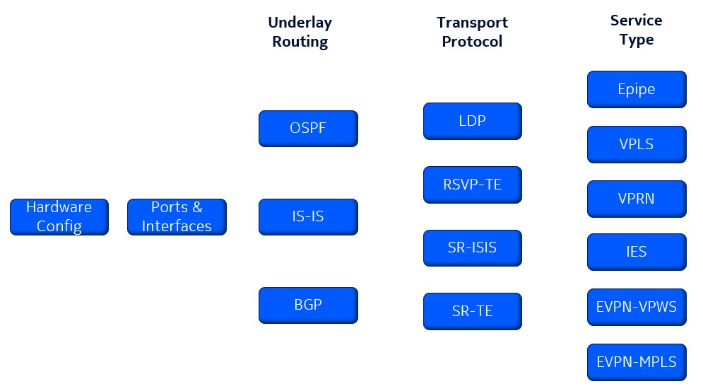
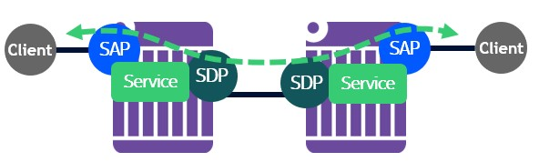
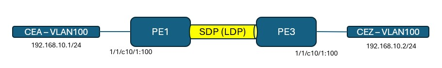

# Nokia SR OS Service Configuration

This page provides the basic step-by-step configuration required to set up services on a Nokia 7750 Service Router. All the required feature sets for each service type are covered here with configuration and show examples. Most sections also provide links to Nokia documentation for further reading.

All configurations are in MD-CLI flat format. Reference chassis is 7750 SR-1-24D and software version is SR OS 25.3.R1. Use `show system info` command to verify your router's chassis model and software version.

The following services are covered in this guide:

- Epipe
- VPLS
- VPRN
- IES
- EVPN-VPWS
- EVPN-MPLS

A summary of what this guide provides is shown below.



Disclaimer: This is not an exhaustive list of all the features and associated options on SR OS for services. This does not replace official documentation but is a one stop reference guide for basic service configuration. For more details on the features and options, please refer to the documentation links in each section.

# Topology

We will be using the below topology with 4 Provider Edge (PE) routers, 2 Provider (P) routers and 4 Customer Edge (CE) routers.

All configuration examples are shown for a single PE router. Refer to the startup config files for configuration on other routers.


# Hardware Configuration

Assuming this is a brand new router, the cards should be configured before we proceed with the peering configuration. If this is already done, you can skip this section.

The card and mda types depend on the variant of the 7750 SR in use. The equipped card and mda types can be seen using the `show card state` command.

Our topology is using a fixed form factor chassis (SR-1-24D) and no hardware configuration is required on this chassis.

For modular systems, the following configuration should be completed to bring up the line card modules. The example config below is for a 7750 SR-2se. Choose the correct card type and level for your chassis.

Configure power modules:

```
/configure chassis router chassis-number 1 power-shelf 1 power-shelf-type ps-a4-shelf-dc
/configure chassis router chassis-number 1 power-shelf 1 power-module 1 power-module-type ps-a-dc-6000
/configure chassis router chassis-number 1 power-shelf 1 power-module 2 power-module-type ps-a-dc-6000
/configure chassis router chassis-number 1 power-shelf 1 power-module 3 power-module-type ps-a-dc-6000
/configure chassis router chassis-number 1 power-shelf 1 power-module 4 power-module-type ps-a-dc-6000
```

Configure fabric cards:

```
/configure sfm 1 sfm-type sfm-2se
/configure sfm 2 sfm-type sfm-2se
/configure sfm 3 sfm-type sfm-2se
/configure sfm 4 sfm-type sfm-2se
```

Configure line card:

```
/configure card 1 card-type xcm-2se
/configure card 1 mda 1 mda-type x2-s36-800g-qsfpdd-12.0t

# On systems with XIOM:
/configure card 1 card-type xcm-2se
/configure card 1 xiom "x1" xiom-type x2-s36-800g-qsfpdd-6.0t
/configure card 1 xiom "x1" mda 1 mda-type m36-800g-qsfpdd
```

The state of the card and MDA can be viewed using the below show command:

```
A:admin@SR1# show card state

===============================================================================
Card State
===============================================================================
Slot/  Provisioned Type                  Admin Operational   Num   Num Comments
Id         Equipped Type (if different)  State State         Ports MDA 
-------------------------------------------------------------------------------
1      xcm-2se                           up    up                  1   
1/1    x2-s36-800g-qsfpdd-12.0t:he12000* up    up            36        
A      cpm-2se                           up    up                      Active
B      cpm-2se                           up    up                      Standby
===============================================================================
```

# Ports and Interfaces

Physical port is configured first following by an interface with an IPv4 or IPv6 address.

Each port is considered as a ‘connector’ and supports breakout. The breakout type used on the connector should be configured first which then unlocks the individual ports in the breakout for configuration.

All ports have an associated port mode. Network facing ports used in the base routing instance should be in 'network' mode (default). Client facing ports used in a service should be in 'access' mode. If a port is both network and client facing, it can be set to 'hybrid' mode. Minimum encap on a hybrid port is dot1q.

In this example, we are configuring the connector to use a 1x100G breakout.

```
/configure port 1/1/c1 admin-state enable
/configure port 1/1/c1 connector breakout c1-100g
/configure port 1/1/c1/1 admin-state enable
/configure port 1/1/c1/1 description "To P1"
```

Below is an example of a client facing port configured as 'access' mode with dot1 encap.

```
/configure port 1/1/c10 admin-state enable
/configure port 1/1/c10 connector breakout c4-10g
/configure port 1/1/c10/1 admin-state enable
/configure port 1/1/c10/1 ethernet mode access
/configure port 1/1/c10/1 ethernet encap-type dot1q
/configure port 1/1/c10/1 ethernet mtu 5000
```    

The status of the port can be viewed using the below command:

```
A:admin@pe1# /show port

===============================================================================
Ports on Slot 1
===============================================================================
Port          Admin Link Port    Cfg  Oper LAG/ Port Port Port   C/QS/S/XFP/
Id            State      State   MTU  MTU  Bndl Mode Encp Type   MDIMDX
-------------------------------------------------------------------------------
1/1/c1        Up         Link Up                          conn   100GBASE-LR4*
1/1/c1/1      Up    Yes  Up      9212 9212    - netw null cgige
1/1/c10       Up         Link Up                          conn   100G-CWDM4 2*
1/1/c10/1     Up    Yes  Up      9000 9000    - accs dotq xgige  
```

The interface is given a name, IP and associated to a physical port.

```
/configure router "Base" interface "To-P1" port 1/1/c1/1
/configure router "Base" interface "To-P1" ipv4 primary address 172.16.10.0 prefix-length 31
```

The `system` interface is the router's loopback interface (like lo0 or loopback0). The name of this interface cannot be changed. If no explicit `router-id` is configured, the `system` interface IPv4 address is used as the router-id. The `system` interface should be assigned a /32 IP.

```
/configure router "Base" interface "system" ipv4 primary address 10.10.10.1 prefix-length 32
```

The status of the interfaces can be seen using the below command:

```
A:admin@pe1# show router interface 

===============================================================================
Interface Table (Router: Base)
===============================================================================
Interface-Name                   Adm       Opr(v4/v6)  Mode    Port/SapId
   IP-Address                                                  PfxState
-------------------------------------------------------------------------------
To-P1                            Up        Up/Down     Network 1/1/c1/1
   172.16.10.0/31                                              n/a
system                           Up        Up/Down     Network system
   10.10.10.1/32                                               n/a
-------------------------------------------------------------------------------
Interfaces : 2
===============================================================================
```

BFD can be enabled under the interface for both IPv4 and IPv6. In SR OS, BFD is enabled once under the interface along with the timers and the state is shared with different protocols running over that interface by enabling `bfd-liveness` under each protocol's context.

```
/configure router "Base" interface "To-P1" ipv4 bfd admin-state enable
```

Enabling BFD state sharing on OSPF:

```
/configure router ospf area 0 interface "To-P1" bfd-liveness remain-down-on-failure true
```

BFD status can be checked using the following command:

```
A:admin@pe1# show router bfd session 

===============================================================================
Legend:
  Session Id = Interface Name | LSP Name | Prefix | RSVP Sess Name | Service Id
  wp = Working path   pp = Protecting path
===============================================================================
BFD Session
===============================================================================
Session Id                                        State      Tx Pkts    Rx Pkts
  Rem Addr/Info/SdpId:VcId                      Multipl     Tx Intvl   Rx Intvl
  Protocols                                        Type     LAG Port     LAG ID
  Loc Addr                                                             LAG name
-------------------------------------------------------------------------------
To-P1                                                Up          273        272
  172.16.10.1                                         3          100        100
  ospf2                                             iom          N/A        N/A
  172.16.10.0                                                                  
-------------------------------------------------------------------------------
No. of BFD sessions: 1
===============================================================================
```

# Underlay Routing

## IGP - OSPF

In this example, we are configuring a OSPFv2 neighbor. Port and interface configuration is similar to what is shown in previous section.

For more details on OSPF configuration, visit [SR OS OSPF Documentation](https://documentation.nokia.com/sr/25-3/7x50-shared/unicast-routing-protocols/ospf.html).

```
/configure router "Base" ospf 0 admin-state enable
/configure router "Base" ospf 0 area 0.0.0.0 interface "To-P1" interface-type point-to-point
/configure router "Base" ospf 0 area 0.0.0.0 interface "system" interface-type point-to-point
```

OSPF neighbor status can be seen using the below command:

```
A:admin@pe1# show router ospf neighbor 

===============================================================================
Rtr Base OSPFv2 Instance 0 Neighbors
===============================================================================
Interface-Name                   Rtr Id          State      Pri  RetxQ   TTL
   Area-Id
-------------------------------------------------------------------------------
To-P1                            10.10.10.10     Full       1    0       38
   0.0.0.0
-------------------------------------------------------------------------------
No. of Neighbors: 1
===============================================================================
```

## IGP - IS-IS

In this example, we are configuring the router to be in IS-IS Level 1 and 2 (default). Port and interface configuration is similar to what is shown in previous section.

For more details on IS-IS configuration, visit [SR OS IS-IS Documentation](https://documentation.nokia.com/sr/25-3/7x50-shared/unicast-routing-protocols/is-is.html).

```
/configure router "Base" isis 0 admin-state enable
/configure router "Base" isis 0 area-address [49.0000]
/configure router "Base" isis 0 interface "To-P1" interface-type point-to-point
/configure router "Base" isis 0 interface "system" interface-type point-to-point
```

IS-IS adjacency status can be seen using the below command:

```
A:admin@pe1# show router isis adjacency 

===============================================================================
Rtr Base ISIS Instance 0 Adjacency 
===============================================================================
System ID                Usage State Hold Interface                     MT-ID
-------------------------------------------------------------------------------
p1                       L1L2  Up    19   To-P1                         0
-------------------------------------------------------------------------------
Adjacencies : 1
===============================================================================
```

## BGP

We will be using BGP to advertise VPN-IPv4 address family for VPRN service and EVPN address family for EVPN-MPLS service.

Only PE1 and PE3 will participate in VPRN service.

All 4 PEs will participate in EVPN-MPLS service.

For more details on BGP configuration, visit [SR OS BGP Documentation](https://documentation.nokia.com/sr/25-3/7x50-shared/unicast-routing-protocols/bgp.html).

```
/configure router "Base" bgp router-id 10.10.10.1
/configure router "Base" bgp group "pe" peer-as 64500
/configure router "Base" bgp neighbor "10.10.10.2" group "pe"
/configure router "Base" bgp neighbor "10.10.10.2" family evpn true
/configure router "Base" bgp neighbor "10.10.10.3" group "pe"
/configure router "Base" bgp neighbor "10.10.10.3" family vpn-ipv4 true
/configure router "Base" bgp neighbor "10.10.10.3" family evpn true
/configure router "Base" bgp neighbor "10.10.10.4" group "pe"
/configure router "Base" bgp neighbor "10.10.10.4" family evpn true
```

BGP neighbor status can be seen using the below command.

```
A:admin@pe1# show router bgp summary 
===============================================================================
 BGP Router ID:10.10.10.1       AS:64500       Local AS:64500      
===============================================================================
BGP Admin State         : Up          BGP Oper State              : Up
Total Peer Groups       : 1           Total Peers                 : 2         
Total VPN Peer Groups   : 0           Total VPN Peers             : 0         
Current Internal Groups : 1           Max Internal Groups         : 1         
Total BGP Paths         : 18          Total Path Memory           : 6624  

-- snip --

===============================================================================
BGP Summary
===============================================================================
Legend : D - Dynamic Neighbor
===============================================================================
Neighbor
Description
                   AS PktRcvd InQ  Up/Down   State|Rcv/Act/Sent (Addr Family)
                      PktSent OutQ
-------------------------------------------------------------------------------
10.10.10.3
                64500       3    0 00h00m20s 0/0/0 (Evpn)
                            3    0           
10.10.10.4
                64500       3    0 00h00m11s 0/0/0 (Evpn)
                            3    0           
-------------------------------------------------------------------------------
```

# Transport Protocol

## LDP

We will enable LDP to be used as a transport tunnel for services.

For more details on LDP configuration, visit [SR OS LDP Documentation](https://documentation.nokia.com/sr/25-3/7x50-shared/mpls/label-distribution-protocol-mpls.html).

```
/configure router "Base" ldp interface-parameters interface "To-P1" ipv4 admin-state enable
/configure router "Base" ldp interface-parameters interface "To-P2" ipv4 admin-state enable
```

To verify LDP, check LDP Discovery status:

```
A:admin@pe1# show router ldp discovery 

===============================================================================
LDP IPv4 Hello Adjacencies
===============================================================================
Interface Name                   Local Addr                              State
AdjType                          Peer Addr                               
-------------------------------------------------------------------------------
To-P1                            10.10.10.1:0                            Estab
link                             10.10.10.10:0                           
                                                                         
To-P2                            10.10.10.1:0                            Estab
link                             10.10.10.20:0                           
                                                                         
-------------------------------------------------------------------------------
No. of IPv4 Hello Adjacencies: 2
===============================================================================
```

Check LDP tunnels:

```
A:admin@pe1# show router tunnel-table protocol ldp 

===============================================================================
IPv4 Tunnel Table (Router: Base)
===============================================================================
Destination           Owner     Encap TunnelId  Pref   Nexthop        Metric
   Color                                                              
-------------------------------------------------------------------------------
10.10.10.2/32         ldp       MPLS  65537     9      172.16.10.1    2
10.10.10.3/32         ldp       MPLS  65540     9      172.16.10.1    2
10.10.10.4/32         ldp       MPLS  65539     9      172.16.10.1    2
10.10.10.10/32        ldp       MPLS  65538     9      172.16.10.1    1
10.10.10.20/32        ldp       MPLS  65541     9      172.16.10.9    1
-------------------------------------------------------------------------------
Flags: B = BGP or MPLS backup hop available
       L = Loop-Free Alternate (LFA) hop available
       E = Inactive best-external BGP route
       k = RIB-API or Forwarding Policy backup hop
===============================================================================
```

## RSVP-TE

We will enable RSVP-TE to be used as a transport tunnel for services.

For more details on RSVP configuration, visit [SR OS RSVP Documentation](https://documentation.nokia.com/sr/25-3/7x50-shared/mpls/mpls-rsvp.html).

Configure RSVP-TE:

```
/configure router "Base" rsvp admin-state enable
/configure router "Base" rsvp interface "To-P1" { }
/configure router "Base" rsvp interface "To-P2" { }
/configure router "Base" rsvp interface "system" { }
```

Configure MPLS:

```
/configure router "Base" mpls admin-state enable
/configure router "Base" mpls interface "To-P1" { }
/configure router "Base" mpls interface "To-P2" { }
/configure router "Base" mpls interface "system" { }
```

Verify RSVP Interface:

```
A:admin@pe1# show router rsvp interface 

===============================================================================
RSVP Interfaces
===============================================================================
Interface                        Total    Active    Total BW  Resv BW   Adm Opr
                                 Sessions Sessions  (Mbps)    (Mbps)        
-------------------------------------------------------------------------------
system                           -        -         -         -         Up  Up
To-P1                            0        0         100000    0         Up  Up
To-P2                            0        0         100000    0         Up  Up
-------------------------------------------------------------------------------
Interfaces : 3
===============================================================================
```

Verify MPLS Interface:

```
A:admin@pe1# show router mpls interface 

===============================================================================
MPLS Interfaces
===============================================================================
Interface                           Port-id           Adm  Opr(V4/V6) TE-
                                                                      metric
-------------------------------------------------------------------------------
system                              system            Up   Up/Down    None
  Admin Groups                      None
  SRLG Groups                       None
To-P1                               1/1/c1/1          Up   Up/Down    None
  Admin Groups                      None
  SRLG Groups                       None
To-P2                               1/1/c2/1          Up   Up/Down    None
  Admin Groups                      None
  SRLG Groups                       None
-------------------------------------------------------------------------------
Interfaces : 3
===============================================================================
```

Configure MPLS LSP:

```
/configure router "Base" mpls path "loose" admin-state enable
/configure router "Base" mpls path "loose" hop 1 ip-address 10.10.10.10
/configure router "Base" mpls path "loose" hop 1 type strict
/configure router "Base" mpls lsp "lsp-to-R3" admin-state enable
/configure router "Base" mpls lsp "lsp-to-R3" type p2p-rsvp
/configure router "Base" mpls lsp "lsp-to-R3" to 10.10.10.3
/configure router "Base" mpls lsp "lsp-to-R3" path-computation-method local-cspf
/configure router "Base" mpls lsp "lsp-to-R3" { primary "loose" }
```

Verify MPLS LSP:

```
A:admin@pe1# show router mpls lsp

===============================================================================
MPLS LSPs (Originating)
===============================================================================
LSP Name                                            Tun     Fastfail  Adm  Opr
  To                                                Id      Config         
-------------------------------------------------------------------------------
lsp-to-R3                                           1       No        Up   Up
  10.10.10.3                                                               
-------------------------------------------------------------------------------
LSPs : 1
===============================================================================
```

```
A:admin@pe1# show router mpls lsp "lsp-to-R3" path detail 

===============================================================================
MPLS LSP lsp-to-R3 Path  (Detail)
===============================================================================
Legend : 
    @ - Detour Available              # - Detour In Use
    b - Bandwidth Protected           n - Node Protected
    s - Soft Preemption           
    S - Strict                        L - Loose
    A - ABR                           + - Inherited
===============================================================================
-------------------------------------------------------------------------------
LSP lsp-to-R3
Path loose
-------------------------------------------------------------------------------
LSP Name    : lsp-to-R3
From             : 10.10.10.1              
To               : 10.10.10.3              
Admin State      : Up                      Oper State        : Up
Path Name   : loose
Path LSP ID      : 43008                   Path Type         : Primary
Path Admin       : Up                      Path Oper         : Up
Out Interface    : 1/1/c1/1                Out Label         : 524277
Path Up Time     : 0d 00:01:02             Path Down Time    : 0d 00:00:00
Retry Limit      : 0                       Retry Timer       : 30 sec
Retry Attempt    : 0                       Next Retry In     : 0 sec
 
BFD Configuration and State
Template         : None                    Ping Interval     : 60
Enable           : False                   State             : notApplicable
WaitForUpTimer   : 4 sec                   OperWaitForUpTimer: N/A
WaitForUpTmLeft  : 0 sec                   
 
Adspec           : Disabled                Oper Adspec       : Disabled
PathCompMethod   : local-cspf              OperPathCompMethod: local-cspf
MetricType       : igp                     Oper MetricType   : igp
Least Fill       : Disabled                Oper LeastFill    : Disabled
FRR              : Disabled                Oper FRR          : Disabled
Propagate Adm Grp: Disabled                Oper Prop Adm Grp : Disabled
Inter-area       : False                   
 
PCE Report       : Disabled+               Oper PCE Report   : Disabled
PCE Control      : Disabled                Oper PCE Control  : Disabled
PCE Update ID    : 0                       
 
Neg MTU          : 8690                    Oper MTU          : 8690
Bandwidth        : No Reservation          Oper Bandwidth    : 0 Mbps
Hop Limit        : 255                     Oper HopLimit     : 255
Record Route     : Record                  Oper Record Route : Record
Record Label     : Record                  Oper Record Label : Record
Setup Priority   : 7                       Oper SetupPriority: 7
Hold Priority    : 0                       Oper HoldPriority : 0
Class Type       : 0                       Oper CT           : 0
Backup CT        : None                    
MainCT Retry     : n/a                     
    Rem          :                         
MainCT Retry     : 0                       
    Limit        :                         
Include Groups   :                         Oper IncludeGroups: 
None                                           None
Exclude Groups   :                         Oper ExcludeGroups: 
None                                           None
 
Adaptive         : Enabled                 Oper Metric       : 11
Preference       : n/a                     
Path Trans       : 1                       CSPF Queries      : 1
Degraded         : False                   
Failure Code     : noError
Failure Node : n/a
Explicit Hops    :                         
                  10.10.10.10(S)
Actual Hops      :                         
    172.16.10.0(10.10.10.1)                      Record Label        : N/A
 -> 172.16.10.1(10.10.10.10)                     Record Label        : 524277
 -> 172.16.10.5(10.10.10.3)                      Record Label        : 524279
Computed Hops    :                         
    172.16.10.0(S)    
 -> 172.16.10.1(S)    
 -> 172.16.10.5(S)    
Resignal Eligible: False                   
Last Resignal    : n/a                     CSPF Metric       : 11
===============================================================================
```

Verify tunnel table:

```
A:admin@pe1# show router tunnel-table protocol rsvp 

===============================================================================
IPv4 Tunnel Table (Router: Base)
===============================================================================
Destination           Owner     Encap TunnelId  Pref   Nexthop        Metric
   Color                                                              
-------------------------------------------------------------------------------
10.10.10.3/32         rsvp      MPLS  1         7      172.16.10.1    11
-------------------------------------------------------------------------------
Flags: B = BGP or MPLS backup hop available
       L = Loop-Free Alternate (LFA) hop available
       E = Inactive best-external BGP route
       k = RIB-API or Forwarding Policy backup hop
===============================================================================
```

## Segment Routing

In this example, we will configure SR-MPLS over ISIS (SR-ISIS). SR OS also supports SR-OSPF.

For more details on SR-MPLS configuration, visit [SR OS SR Documentation](https://documentation.nokia.com/sr/25-3/7x50-shared/segment-routing-pce-user/segment-rout-with-mpls-data-plane-sr-mpls.html).

Configure MPLS label range for Segment Routing:

```
/configure router "Base" mpls-labels sr-labels start 21000
/configure router "Base" mpls-labels sr-labels end 22000
```

Configure Segment Routing for ISIS:

```
/configure router "Base" isis 0 advertise-router-capability as
/configure router "Base" isis 0 traffic-engineering true
/configure router "Base" isis 0 segment-routing admin-state enable
/configure router "Base" isis 0 segment-routing prefix-sid-range global
/configure router "Base" isis 0 interface "system" ipv4-node-sid index 1
```

Verify Segment Routing tunnels:

```
A:admin@pe1# show router tunnel-table protocol isis 

===============================================================================
IPv4 Tunnel Table (Router: Base)
===============================================================================
Destination           Owner     Encap TunnelId  Pref   Nexthop        Metric
   Color                                                              
-------------------------------------------------------------------------------
10.10.10.2/32         isis (0)  MPLS  524292    11     172.16.10.1    20
10.10.10.3/32         isis (0)  MPLS  524291    11     172.16.10.1    20
10.10.10.4/32         isis (0)  MPLS  524293    11     172.16.10.1    20
10.10.10.10/32        isis (0)  MPLS  524290    11     172.16.10.1    10
10.10.10.20/32        isis (0)  MPLS  524295    11     172.16.10.9    10
172.16.10.1/32        isis (0)  MPLS  524289    11     172.16.10.1    0
172.16.10.9/32        isis (0)  MPLS  524294    11     172.16.10.9    0
-------------------------------------------------------------------------------
Flags: B = BGP or MPLS backup hop available
       L = Loop-Free Alternate (LFA) hop available
       E = Inactive best-external BGP route
       k = RIB-API or Forwarding Policy backup hop
===============================================================================
```

## SR-TE

Segment Routing - Traffic Engineering (SR-TE) can be used to build LSPs similar to RSVP-TE.

For more details on SR-TE configuration, visit [SR OS SR-TE Documentation](https://documentation.nokia.com/sr/25-3/7x50-shared/segment-routing-pce-user/segment-rout-with-mpls-data-plane-sr-mpls.html#ai9ekdb660).

In this example, we will configure a SR-TE LSP using loose hops in which case the IGP path will be selected.

```
/configure router "Base" mpls path "loose" admin-state enable
/configure router "Base" mpls lsp "lsp-sr-te-R3" admin-state enable
/configure router "Base" mpls lsp "lsp-sr-te-R3" type p2p-sr-te
/configure router "Base" mpls lsp "lsp-sr-te-R3" to 10.10.10.3
/configure router "Base" mpls lsp "lsp-sr-te-R3" path-computation-method local-cspf
/configure router "Base" mpls lsp "lsp-sr-te-R3" primary "loose" { }
```

Verify SR-TE LSP status:

```
A:admin@pe1# show router mpls sr-te-lsp "lsp-sr-te-R3" 

===============================================================================
MPLS SR-TE LSPs (Originating)
===============================================================================
LSP Name                                            Tun     Protect   Adm  Opr
  To                                                Id      Path           
-------------------------------------------------------------------------------
lsp-sr-te-R3                                        1       N/A       Up   Up
  10.10.10.3                                                               
-------------------------------------------------------------------------------
LSPs : 1
===============================================================================
```

Verify SR-TE LSP path:

```
A:admin@pe1# show router mpls sr-te-lsp "lsp-sr-te-R3" path detail 

===============================================================================
MPLS SR-TE LSP lsp-sr-te-R3
Path  (Detail)
===============================================================================
Legend : 
    S      - Strict                      L      - Loose
    A-SID  - Adjacency SID               N-SID  - Node SID 
    +      - Inherited 
===============================================================================
-------------------------------------------------------------------------------
LSP SR-TE lsp-sr-te-R3
Path  loose
-------------------------------------------------------------------------------
LSP Name    : lsp-sr-te-R3
Path LSP ID      : 49152                   
From             : 10.10.10.1              
To               : 10.10.10.3              
Admin State      : Up                      Oper State        : Up
Path Name   : loose
Path Type        : Primary                 
Path Admin       : Up                      Path Oper         : Up
Path Up Time     : 3d 02:38:51             Path Down Time    : 0d 00:00:00
Retry Limit      : 0                       Retry Timer       : 30 sec
Retry Attempt    : 0                       Next Retry In     : 0 sec
<--snip-->
IGP/TE/Del Metric: 200                     Oper Metric       : 200
Oper MTU         : 8682                    Path Trans        : 3
Degraded         : False                   
Failure Code     : noError
Failure Node     : n/a
Explicit Hops    :                         
    No Hops Specified
Actual Hops      :                         
    172.16.10.9(10.10.10.20)(A-SID)              Record Label        : 524276
 -> 172.16.10.12(10.10.10.3)(A-SID)              Record Label        : 524276

===============================================================================
```


# ACL

ACL filter policies, also referred to as Access Control Lists (ACLs) or just ‟filters”, are sets of ordered rule entries specifying packet match criteria and actions to be performed to a packet upon a match. Filter policies are created with a unique filter ID and filter name. After the filter policy is created, the policy must then be associated with services.

For more details on ACL, visit [SR OS ACL Documentation](https://documentation.nokia.com/sr/25-3/7x50-shared/router-configuration/filter-policies-router-configuration.html).

Refer to the section for each service type for examples on applying ACL to that service type.

Below is an example of a IPv4 ACL.

```
/configure filter ip-filter "Epipe-ACL" filter-id 101
/configure filter ip-filter "Epipe-ACL" entry 10 match protocol icmp
/configure filter ip-filter "Epipe-ACL" entry 10 match dst-ip address 192.168.10.2
/configure filter ip-filter "Epipe-ACL" entry 10 match dst-ip mask 255.255.255.255
/configure filter ip-filter "Epipe-ACL" entry 10 action accept
```

The ACL is applied to the service SAP.

```
/configure service epipe "CEA1-VLAN100" sap 1/1/c10/1:100 ingress filter ip "Epipe-ACL"
```

ACL statistics can be seen using the below command:

```
A:admin@pe1# show filter ip "Epipe-ACL" 

===============================================================================
IP Filter
===============================================================================
Filter Id           : 101                          Applied        : Yes
Scope               : Template                     Def. Action    : Drop
Type                : Normal                       
Shared Policer      : Off                          
System filter       : Unchained                    
Radius Ins Pt       : n/a                          
CrCtl. Ins Pt       : n/a                          
RadSh. Ins Pt       : n/a                          
PccRl. Ins Pt       : n/a                          
Entries             : 1                            
Description         : (Not Specified)
Filter Name         : Epipe-ACL
-------------------------------------------------------------------------------
Filter Match Criteria : IP
-------------------------------------------------------------------------------
Entry               : 10
Description         : (Not Specified)
Log Id              : n/a                          
Src. IP             : 0.0.0.0/0
Src. Port           : n/a
Dest. IP            : 192.168.10.2/32
Dest. Port          : n/a
Protocol            : icmp
Dscp                : Undefined                    
ICMP Type           : Undefined                    ICMP Code      : Undefined
Fragment            : Off                          Src Route Opt  : Off
Sampling            : Off                          Int. Sampling  : On
IP-Option           : 0/0                          Multiple Option: Off
Tcp-flag            : (Not Specified)
Option-pres         : Off                          
Egress PBR          : Disabled                     
Primary Action      : Forward                      
Ing. Matches        : 438 pkts (46428 bytes)
Egr. Matches        : 0 pkts
===============================================================================
```

# QoS

SR OS implements QoS with a 4-step process – Classification, Queueing, Scheduling and (Re)Marking.

QoS policies can be applied under the following contexts:

- SAP Ingress (for traffic ingressing a service)
- SAP Egress (for traffic egressing a service)
- Network Ingress (for traffic ingressing a Network facing port or uplink)
- Network Egress (for traffic egressing a Network facing port or uplink)

For more details on QoS implementation, visit [SR OS QoS Documentation](https://documentation.nokia.com/aces/sr/25-3/7750-sr/titles/qos.html).

## QoS - Classification

At Service Ingress, Classification is configured in a `sap-ingress` policy.

```
/configure qos sap-ingress "Epipe-ingress-QoS" dscp cs1 fc "af"
```

The `sap-ingress` policy is applied to the service SAP.

```
/configure service epipe "CEA1-VLAN100" sap 1/1/c10/1:100 ingress qos sap-ingress policy-name "Epipe-ingress-QoS"
```

At Network Ingress, Classification is configured in a `network` policy.

```
/configure qos network "Network-QoS" policy-id 10
/configure qos network "Network-QoS" ingress dscp cs1 fc af
/configure qos network "Network-QoS" ingress dscp cs1 profile in
/configure qos network "Network-QoS" ingress lsp-exp 6 fc h1
/configure qos network "Network-QoS" ingress lsp-exp 6 profile in
```

The Network classification policy is applied to the network facing interface.

```
/configure router "Base" interface "To-P1" qos network-policy "Network-QoS"
```

Refer to the section for each service type for examples on applying QoS classification to that service type.

## QoS - Queuing

At Service Ingress, Queuing is configured in a `sap-ingress` policy.

```
/configure qos sap-ingress "Epipe-ingress-QoS" policy-id 11
/configure qos sap-ingress "Epipe-ingress-QoS" queue 2 rate pir 100
/configure qos sap-ingress "Epipe-ingress-QoS" queue 2 rate cir 100
/configure qos sap-ingress "Epipe-ingress-QoS" fc "af" queue 2
/configure qos sap-ingress "Epipe-ingress-QoS" fc "af" profile in
```

At Service Egress, Queuing is configured in a `sap-egress` policy.

```
/configure qos sap-egress "Epipe-egress-QoS" policy-id 12
/configure qos sap-egress "Epipe-egress-QoS" queue 3 rate pir 100
/configure qos sap-egress "Epipe-egress-QoS" queue 3 rate cir 100
/configure qos sap-egress "Epipe-egress-QoS" fc be queue 3
```

Both `sap-ingress` and `sap-egress` policies are applied under the service SAP.

```
/configure service epipe "CEA1-VLAN100" sap 1/1/c10/1:100 ingress qos sap-ingress policy-name "Epipe-ingress-QoS"
/configure service epipe "CEA1-VLAN100" sap 1/1/c10/1:100 egress qos sap-egress policy-name "Epipe-egress-QoS"
```

At Network Ingress and Egress, Queuing is configured in a `network-queue` policy.

```
/configure qos network-queue "Network-queue" fc af queue 3
/configure qos network-queue "Network-queue" fc ef queue 2
/configure qos network-queue "Network-queue" queue 2 rate pir 15
/configure qos network-queue "Network-queue" queue 2 rate cir 10
/configure qos network-queue "Network-queue" queue 3 rate pir 10
/configure qos network-queue "Network-queue" queue 3 rate cir 5
```

For ingress network queueing, the queuing policy is applied under the FP context of the line card.

```
/configure card 1 fp 1 ingress network queue-policy "Peering-Queue"
```

For egress network queuing, the queuing policy is applied under the physical port.

```
/configure port 1/1/c1/1 ethernet network egress queue-policy "Network-queue"
```

## QoS - Scheduling

The example shows a simple port-based scheduler that can be applied to schedule traffic out of a network facing port. SR OS also supports Hierarchical schedulers and Slope policies.

Similar policies can also be applied under a `sap-egress` policy to schedule multiple traffic types at Service egress.

```
/configure qos port-scheduler-policy "simple-scheduler" max-rate 100000000
/configure qos port-scheduler-policy "simple-scheduler" level 1 rate pir 90
/configure qos port-scheduler-policy "simple-scheduler" level 1 rate cir 10
/configure qos port-scheduler-policy "simple-scheduler" level 6 rate pir max
/configure qos port-scheduler-policy "simple-scheduler" level 6 rate cir max
/configure qos port-scheduler-policy "simple-scheduler" level 7 rate pir max
/configure qos port-scheduler-policy "simple-scheduler" level 7 rate cir max
/configure qos port-scheduler-policy "simple-scheduler" level 8 rate pir max
/configure qos port-scheduler-policy "simple-scheduler" level 8 rate cir max
```

The port based scheduler policy is applied to the physical port.

```
/configure port 1/1/c1/1 ethernet egress port-scheduler-policy policy-name "simple-scheduler"
```

## Qos - Remarking

At Service Egress, remarking is configured in the `sap-egress` policy.

```
/configure qos sap-egress "Epipe-egress-QoS" fc be dscp in-profile cp31
/configure qos sap-egress "Epipe-egress-QoS" fc be dscp out-profile cp31
/configure qos sap-egress "Epipe-egress-QoS" fc af dscp in-profile cs4
/configure qos sap-egress "Epipe-egress-QoS" fc af dscp out-profile cs4
```

The `sap-egress` policy is applied under the service SAP context.

```
/configure service epipe "CEA1-VLAN100" sap 1/1/c10/1:100 egress qos sap-egress policy-name "Epipe-egress-QoS"
```

At Network Egress, remarking is configured in the `network` policy.

```
/configure qos network "Network-QoS" egress fc be lsp-exp-in-profile 0
/configure qos network "Network-QoS" egress fc be lsp-exp-out-profile 0
/configure qos network "Network-QoS" egress fc af dscp-in-profile cs1
/configure qos network "Network-QoS" egress fc h1 lsp-exp-in-profile 6
```

The remarking policy is applied under the interface.

```
/configure router "Base" interface "To-P1" qos network-policy "Network-QoS"
```

# Service Components

A service model in SR OS uses the following logical entities to construct a service.



- Service Access Point (SAP) - identifies the customer facing interface with null, dot1 or qinq encapsulation.

- Service Distribution Point (SDP) - unidirectional transport tunnel that connects services between 2 routers. SDPs can use GRE, LDP, RSVP-TE or Segment Routing tunnels. SDP is independant of service or type of service. Multiple services of same or different type can use the same SDP. In this case, traffic for each service will be separated using a unique `vc-id` defined while attached the SDP to a service.

For services that use BGP for transport signalling (VPRN, EVPN, VPLS), SDP configuration can be replaced by `auto-bind` feature allowing to select from a variety of tunnel types.

## SAP

A Service Access Point (SAP) is a client facing interface and is the ingress point of the packets that will be carried over a service to the remote destination.

To configure a port as a SAP, set the ethernet mode of the port to either `access` or `hybrid`. If required, set the required ethernet encapsulation and MTU.

Note - in `hybrid` mode, minimum encapsulation is dot1q

```
/configure port 1/1/c10/1 admin-state enable
/configure port 1/1/c10/1 ethernet mode access
/configure port 1/1/c10/1 ethernet encap-type dot1q
/configure port 1/1/c10/1 ethernet mtu 5000
```

SAPs are configured within a service configuration context.

```
/configure service epipe "CEA1-VLAN100" sap 1/1/c10/1:100
```

To list all SAPs that are configured under all services:

```
A:admin@pe1# show service sap-using 

===============================================================================
Service Access Points 
===============================================================================
PortId                          SvcId      Ing.  Ing.    Egr.  Egr.   Adm  Opr
                                           QoS   Fltr    QoS   Fltr        
-------------------------------------------------------------------------------
1/1/c10/1:100                   10         11    ip4     12    none   Up   Up
1/1/c10/1:200                   20         1     none    1     none   Up   Up
-------------------------------------------------------------------------------
Number of SAPs : 2
-------------------------------------------------------------------------------
===============================================================================
```

## SDP

A Service Distribution Point (SDP) is a unidirectional transport tunnel to carry one or more services.

Before configuring a SDP, configure the transport protocol that will be used by SDP - GRE, LDP, RSVP-TE, SR, SR-TE.

SDP is identified by a numerical id.

In this example, we are creating a SDP to PE3 that will use LDP.

```
/configure service sdp 55 admin-state enable
/configure service sdp 55 delivery-type mpls
/configure service sdp 55 ldp true
/configure service sdp 55 far-end ip-address 10.10.10.3
```

The association of the service with the SDP is done under the service context. The SDP id is used along with a unique `vc-id` which is used as the service label in the MPLS encapsulation of the customer packet.

```
/configure service epipe "CEA1-VLAN100" spoke-sdp 55:100
```

To verify the status of a SDP:

```
A:admin@pe1# show service sdp 55

============================================================================
Service Destination Point (Sdp Id : 55)
============================================================================
SdpId  AdmMTU  OprMTU  Far End          Adm  Opr         Del     LSP   Sig
----------------------------------------------------------------------------
55     0       8682    10.10.10.3       Up   Up          MPLS    L     TLDP
============================================================================
```

To see a list of SDP's used on all services:

```
A:admin@pe1# show service sdp-using 

===============================================================================
SDP Using
===============================================================================
SvcId      SdpId              Type   Far End              Opr   I.Label E.Label
                                                          State         
-------------------------------------------------------------------------------
10         55:100             Spok   10.10.10.3           Up    524277  524277
20         65:200             Spok   10.10.10.3           Up    524265  524265
-------------------------------------------------------------------------------
Number of SDPs : 2
-------------------------------------------------------------------------------
===============================================================================
```

# Epipe

An Epipe service is a Layer 2 point-to-point service where the customer data is encapsulated and transported across a service provider IP or MPLS network. An Epipe service is completely transparent to the customer data and protocols. The Epipe service does not perform any MAC learning. A local Epipe service consists of two SAPs on the same node, whereas a distributed Epipe service consists of two SAPs on different nodes. SDPs are not used in local Epipe services.

For more details on Epipe, visit [SR OS Epipe Documentation](https://documentation.nokia.com/sr/25-3/7x50-shared/layer-2-services-evpn/vll-services.html#ai9emdyvq8).

The epipe topology for this example is shown below:



**Configuration**

CE facing Port configuration on PE1 and PE3:

```
/configure port 1/1/c10/1 admin-state enable
/configure port 1/1/c10/1 ethernet mode access
/configure port 1/1/c10/1 ethernet encap-type dot1q
/configure port 1/1/c10/1 ethernet mtu 5000
```

SDP configuration on PE1:

```
/configure service sdp 55 admin-state enable
/configure service sdp 55 delivery-type mpls
/configure service sdp 55 ldp true
/configure service sdp 55 far-end ip-address 10.10.10.3
```

SDP configuration on PE3:

```
/configure service sdp 56 admin-state enable
/configure service sdp 56 delivery-type mpls
/configure service sdp 56 ldp true
/configure service sdp 56 far-end ip-address 10.10.10.1
```

ACL configuration on PE1:

```
/configure filter ip-filter "Epipe-ACL" filter-id 101
/configure filter ip-filter "Epipe-ACL" entry 10 match protocol icmp
/configure filter ip-filter "Epipe-ACL" entry 10 match dst-ip address 192.168.10.2
/configure filter ip-filter "Epipe-ACL" entry 10 match dst-ip mask 255.255.255.255
/configure filter ip-filter "Epipe-ACL" entry 10 action accept
```

SAP Ingress QoS configuration on PE1:

```
/configure qos sap-ingress "Epipe-ingress-QoS" policy-id 11
/configure qos sap-ingress "Epipe-ingress-QoS" queue 2 rate pir 100
/configure qos sap-ingress "Epipe-ingress-QoS" queue 2 rate cir 100
/configure qos sap-ingress "Epipe-ingress-QoS" dscp cs1 fc "af"
/configure qos sap-ingress "Epipe-ingress-QoS" fc "af" queue 2
/configure qos sap-ingress "Epipe-ingress-QoS" fc "af" profile in
```

SAP Egress QoS configuration on PE1:

```
/configure qos sap-egress "Epipe-egress-QoS" policy-id 12
/configure qos sap-egress "Epipe-egress-QoS" queue 3 rate pir 100
/configure qos sap-egress "Epipe-egress-QoS" queue 3 rate cir 100
/configure qos sap-egress "Epipe-egress-QoS" fc be queue 3
/configure qos sap-egress "Epipe-egress-QoS" fc be dscp in-profile cp31
/configure qos sap-egress "Epipe-egress-QoS" fc be dscp out-profile cp31
/configure qos sap-egress "Epipe-egress-QoS" fc af queue 3
/configure qos sap-egress "Epipe-egress-QoS" fc af dscp in-profile cs4
/configure qos sap-egress "Epipe-egress-QoS" fc af dscp out-profile cs4
```

Epipe configuration on PE1:

```
/configure service epipe "CEA1-VLAN100" admin-state enable
/configure service epipe "CEA1-VLAN100" description "Epipe-CEA1-VLAN100-CEZ1-VLAN100"
/configure service epipe "CEA1-VLAN100" service-id 10
/configure service epipe "CEA1-VLAN100" customer "1"
/configure service epipe "CEA1-VLAN100" spoke-sdp 55:100 { }
/configure service epipe "CEA1-VLAN100" sap 1/1/c10/1:100 ingress qos sap-ingress policy-name "Epipe-ingress-QoS"
/configure service epipe "CEA1-VLAN100" sap 1/1/c10/1:100 ingress filter ip "Epipe-ACL"
/configure service epipe "CEA1-VLAN100" sap 1/1/c10/1:100 egress qos sap-egress policy-name "Epipe-egress-QoS"
```

Verify Epipe status:

```
A:admin@pe1# show service id "CEA1-VLAN100" base

===============================================================================
Service Basic Information
===============================================================================
Service Id        : 10                  Vpn Id            : 0
Service Type      : Epipe               
MACSec enabled    : no                  
Name              : CEA1-VLAN100
Description       : Epipe-CEA1-VLAN100-CEZ1-VLAN100
Customer Id       : 1                   Creation Origin   : manual
Last Status Change: 06/27/2025 21:16:51 
Last Mgmt Change  : 06/27/2025 20:44:01 
Test Service      : No                  
Admin State       : Up                  Oper State        : Up
MTU               : 1514                
Vc Switching      : False               
SAP Count         : 1                   SDP Bind Count    : 1
Per Svc Hashing   : Disabled            Lbl Eth/IP L4 TEID: Disabled
Ignore MTU Mismat*: Disabled            
Vxlan Src Tep Ip  : N/A
Force QTag Fwd    : Disabled            
Lcl Switch Svc St : sap                 
Oper Group        : <none>              
 
-------------------------------------------------------------------------------
Service Access & Destination Points
-------------------------------------------------------------------------------
Identifier                               Type         AdmMTU  OprMTU  Adm  Opr
-------------------------------------------------------------------------------
sap:1/1/c10/1:100                        q-tag        5000    5000    Up   Up
sdp:55:100 S(10.10.10.3)                 Spok         0       8682    Up   Up
===============================================================================
```

To verify details of all service components:

```
A:admin@pe1# show service id "CEA1-VLAN100" all 
```

To verify SAP queue stats:

```
A:admin@pe1# show service id "CEA1-VLAN100" sap "1/1/c10/1:100" stats 

===============================================================================
Service Access Points(SAP)
===============================================================================
Service Id         : 10                       
SAP                : 1/1/c10/1:100            Encap             : q-tag
Description        : (Not Specified)
Admin State        : Up                       Oper State        : Up
Flags              : None
Multi Svc Site     : None                     
Last Status Change : 06/27/2025 20:18:14      
Last Mgmt Change   : 06/27/2025 21:00:16      
-------------------------------------------------------------------------------
Sap per Queue stats
-------------------------------------------------------------------------------
                        Packets                 Octets
 
Ingress Queue 1 (Unicast) (Priority)
Off. HiPrio           : 0                       0                        
Off. LowPrio          : 431                     32806                    
Dro. HiPrio           : 0                       0                        
Dro. LowPrio          : 0                       0                        
For. InProf           : 0                       0                        
For. OutProf          : 431                     32806                    
 
Ingress Queue 2 (Unicast) (Priority)
Off. HiPrio           : 0                       0                        
Off. LowPrio          : 383                     40598                    
Dro. HiPrio           : 0                       0                        
Dro. LowPrio          : 0                       0                        
For. InProf           : 0                       0                        
For. OutProf          : 383                     40598                    
 
Egress Queue 1
For. In/InplusProf    : 0                       0                        
For. Out/ExcProf      : 82                      8020                     
Dro. In/InplusProf    : 0                       0                        
Dro. Out/ExcProf      : 0                       0                        
 
Egress Queue 3
For. In/InplusProf    : 0                       0                        
For. Out/ExcProf      : 648                     57236                    
Dro. In/InplusProf    : 0                       0                        
Dro. Out/ExcProf      : 0                       0                        
===============================================================================
```

**Customer Verfiication**

Login to CEA:

```
docker exec -it cea bash
```

Ping CEZ VLAN 100 from CEA:

```
└──> ping -c 3 192.168.10.2
PING 192.168.10.2 (192.168.10.2) 56(84) bytes of data.
64 bytes from 192.168.10.2: icmp_seq=1 ttl=64 time=10.3 ms
64 bytes from 192.168.10.2: icmp_seq=2 ttl=64 time=5.03 ms
64 bytes from 192.168.10.2: icmp_seq=3 ttl=64 time=5.07 ms

--- 192.168.10.2 ping statistics ---
3 packets transmitted, 3 received, 0% packet loss, time 2003ms
rtt min/avg/max/mdev = 5.030/6.805/10.316/2.482 ms
```

# VPLS

VPLS is a class of virtual private network service that allows the connection of multiple sites in a single bridged domain over a provider-managed IP/MPLS network. The customer sites in a VPLS instance appear to be on the same LAN, regardless of their location. VPLS uses an Ethernet interface on the customer-facing (access) side, which simplifies the LAN/WAN boundary and allows for rapid and flexible service provisioning.

A VPLS service provides connectivity between two or more SAPs on one (which is considered a local service) or more (which is considered a distributed service) service routers. The connection appears to be a bridged domain to the customer sites so protocols, including routing protocols, can traverse the VPLS service.

For more details on VPLS, visit [SR OS VPLS Documentation](https://documentation.nokia.com/sr/25-3/7x50-shared/layer-2-services-evpn/virtual-private-lan-service.html).


# VPRN

VPRN (commonly called VRF) is a method of distributing routing information using BGP and MPLS forwarding data to provide a Layer 3 Virtual Private Network (VPN) service to end customers

Each Virtual Private Routed Network (VPRN) consists of a set of customer sites connected to one or more PE routers. Each associated PE router maintains a separate IP forwarding table for each VPRN. Additionally, the PE routers exchange the routing information configured or learned from all customer sites via MP-BGP peering. Each route exchanged via the MP-BGP protocol includes a Route Distinguisher (RD), which identifies the VPRN association and handles the possibility of IP address overlap.

For more details on VPRN, visit [SR OS VPRN Documentation](https://documentation.nokia.com/sr/25-3/7x50-shared/layer-3-services/vprn-service.html).


# IES

IES is a routed connectivity service where the subscriber communicates with an IP router interface to send and receive Internet traffic. An IES has one or more logical IP routing interfaces, each with a SAP that acts as the access point to the subscriber network.

IES allows IP interfaces to participate in the same routing instance used for service network core routing connectivity. 

For more details on IES, visit [SR OS IES Documentation](https://documentation.nokia.com/sr/25-3/7x50-shared/layer-3-services/internet-enhanced-service.html).


# EVPN-VPWS

EVPN is an IETF technology as defined in RFC 7432, BGP MPLS-Based Ethernet VPN, that uses a specific BGP address family and allows VPLS services to be operated as IP-VPNs, where the MAC addresses and the information to set up the flooding trees are distributed by BGP.

EVPN-VPWS provides Epipe point-to-point services.

For more details on EVPN-VPWS, visit [SR OS EVPN Documentation](https://documentation.nokia.com/sr/25-3/7x50-shared/layer-2-services-evpn/ethernet-virtual-private-networks.html).


# EVPN-VPLS with Multihoming

EVPN is an IETF technology as defined in RFC 7432, BGP MPLS-Based Ethernet VPN, that uses a specific BGP address family and allows VPLS services to be operated as IP-VPNs, where the MAC addresses and the information to set up the flooding trees are distributed by BGP.

EVPN-MPLS is supported where PEs are connected by any type of MPLS tunnel. EVPN-MPLS is generally used as an evolution for VPLS services in the WAN, and Data Center Interconnect is one of the main applications.

EVPN can be used in MPLS networks where PEs are interconnected through any type of tunnel, including RSVP-TE, Segment-Routing TE, LDP, BGP, Segment Routing IS-IS, Segment Routing OSPF, RIB-API, MPLS-forwarding-policy, SR-Policy, or MPLSoUDP. 

For more details on EVPN-VPLS, visit [SR OS EVPN Documentation](https://documentation.nokia.com/sr/25-3/7x50-shared/layer-2-services-evpn/ethernet-virtual-private-networks.html).
